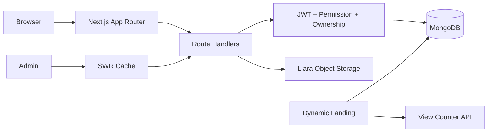

1. خلاصه اجرایی
   Radlink یک monolith مبتنی بر Next.js 16, React 19, TypeScript و MongoDB/Mongoose است. ساختار کلی قابل توسعه است، ownership و permission در بسیاری از routeها اعمال شده و production build موفق است؛ اما به‌دلیل authentication bypass قطعی، نبود تست، transaction، rate limiting و observability، در وضعیت فعلی آماده production نیست.
   حوزه امتیاز دلیل
   Architecture 5/10 ماژول‌های مشخص، ولی UI/API/jobs در یک process و فایل‌های بسیار بزرگ
   Code quality 4/10 build موفق؛ lint دارای ۸۶ error و ۸۷ warning
   Database scalability 3/10 skip, regex scan، embedded arrays و indexهای ناکافی
   API scalability 4/10 pagination دارد؛ validation، idempotency و rate limit ناقص
   Frontend performance 4/10 SWR موجود؛ client bundle و componentهای بسیار بزرگ
   Security 1/10 OTP verification عملاً غیرفعال است
   Reliability 3/10 writeهای چندمرحله‌ای بدون transaction/queue
   Observability 1/10 تقریباً فقط console
   Testing 0/10 هیچ test suite یا test script وجود ندارد
   Production readiness 1/10 P0 authentication bypass

پنج خطر اصلی: OTP bypass، آپلود حافظه‌محور، permission cache ناسازگار میان instanceها، schemaهای بدون سقف، و عملیات چندمرحله‌ای بدون transaction. 2. معماری Repository
Frontend: app/, components/, builder/, contexts/, hook/
Backend: ۳۳ Route Handler در app/api/
Data: ۱۳ Mongoose model در models/
Auth: JWT هفت‌روزه، OTP، role، static/dynamic access و ownership
Cache: SWR مرورگر، React request memoization، Next revalidation و cache حافظه‌ای permission
Storage: Liara S3-compatible؛ فایل‌ها public و دائمی
Queue/cron/realtime/Redis: وجود ندارد
Docker/CI/CD/health check/tests: وجود ندارد
External integration: Liara Object Storage؛ SMS فعلاً mock است.

جریان‌های حیاتی: OTP login، مدیریت user/agent/access/permission، builder→page/template، public landing render، upload، QR creation، ticket conversation و notification. 3. یافته‌های بحرانی
Authentication بدون بررسی OTP
Severity: Critical؛ Confidence: Confirmed؛ Category: Authentication bypass / OWASP Authentication Failures
File: [verify-otp route (line 16)](D:/Next/radlink/app/api/auth/verify-otp/route.ts:16)، function: POST
رفتار: بررسی record.otp !== otp و expiresAt در خطوط 18–25 کامنت شده و route مستقیماً user را verified کرده و JWT می‌دهد.
Trigger: ارسال هر phoneNumber موجود همراه هر مقدار غیرخالی otp.
Impact: تصاحب کامل حساب، شامل admin و superAdmin.
Fix: فعال‌سازی compare/expiry، hash OTP، attempt counter، atomic consume، Redis/DB TTL و rate limit براساس phone/IP.
Migration risk: Medium؛ sessionهای فعلی باید revoke یا secret rotate شوند.
Test: OTP غلط/منقضی/مصرف‌شده باید 401 دهد؛ فقط OTP صحیح یک بار موفق شود.
OTP در process و log
Severity: Critical؛ Confidence: Confirmed
Files: [send-otp (line 8)](D:/Next/radlink/app/api/auth/send-otp/route.ts:8)، [otp-store (line 1)](D:/Next/radlink/lib/auth/otp-store.ts:1)
Math.random() برای OTP، چاپ phone+OTP در log و Map محلی استفاده شده است.
در چند instance، verify ممکن است به instance دیگری برسد؛ restart تمام OTPها را حذف می‌کند؛ Map cleanup ندارد.
Fix: provider واقعی، crypto.randomInt، Redis TTL، attempt/rate limit و حذف secret logging.
Permission cache در deployment چند-instance ناسازگار است
Severity: High؛ Confidence: Confirmed
Files: [accessCache (line 1)](D:/Next/radlink/lib/auth/accessCache.ts:1)، [resolveUserAccess (line 8)](D:/Next/radlink/lib/auth/resolveUserAccess.ts:8)
cache پنج‌دقیقه‌ای فقط در حافظه همان process invalidate می‌شود؛ instanceهای دیگر access قدیمی را تا TTL می‌پذیرند.
Impact: دسترسی حذف‌شده می‌تواند پنج دقیقه معتبر بماند.
Fix: Redis namespaced cache یا versioned permission در User/JWT؛ invalidation با pub/sub.
Upload حافظه‌محور و قابل DoS
Severity: High؛ Confidence: Confirmed؛ Category: File Upload Risk
File: [uploads route (line 61)](D:/Next/radlink/app/api/uploads/route.ts:61)، POST
req.formData() و سپس file.arrayBuffer() کل فایل ۵۰MB را در RAM نگه می‌دارند؛ MIME به header مرورگر اعتماد دارد.
در ۱۰۰ upload همزمان، مصرف نظری payload حدود ۵GB است و copyهای Buffer فشار بیشتری می‌آورند.
Fix: presigned multipart upload مستقیم به S3، magic-byte validation، malware scan، per-user/IP concurrency limit.
Writeهای چندمرحله‌ای بدون transaction
Severity: High؛ Confidence: Confirmed
Files: [permissions POST (line 29)](D:/Next/radlink/app/api/permissions/route.ts:29)، [template POST (line 121)](D:/Next/radlink/app/api/templates/route.ts:121)، [category PATCH (line 74)](D:/Next/radlink/app/api/categories/[id]/route.ts:74)، [QR service (line 82)](D:/Next/radlink/lib/qrCode.ts:82)
Permission↔User، Template↔Category و QR↔File↔S3 مستقل update می‌شوند.
Crash یا timeout می‌تواند relation یک‌طرفه، orphan file/object یا permission ناقص بسازد.
Fix: Mongo transaction برای DB writes؛ outbox/saga برای S3؛ idempotency key و reconciliation job. 4. گلوگاه‌های Database
ID Severity File/Query مشکل نقطه جدی Index/rewrite
DB1 High [Page model (line 380)](D:/Next/radlink/models/pages.ts:380) blocks و Mixed data بدون سقف؛ خطر 16MB بسته به block size، حتی صدها block انتقال block instances به collection مستقل
DB2 High [Ticket model (line 41)](D:/Next/radlink/models/tickets.ts:41) replies و attachments رشد نامحدود ticketهای طولانی TicketReply collection با cursor
DB3 High تمام list routeها offset pagination با skip 100k به بعد؛ در 1M/10M شدید cursor بر (createdAt,\_id)
DB4 High [Users GET (line 54)](D:/Next/radlink/app/api/users/route.ts:54) regex چندفیلدی case-insensitive؛ index معمولی قابل استفاده نیست 100k+ normalized search fields یا Atlas Search
DB5 Medium [Pages GET (line 453)](D:/Next/radlink/app/api/pages/route.ts:453) owner/access filter + sort بدون compound index 100k+ {owner:1,updatedAt:-1,\_id:-1}
DB6 Medium [Files GET (line 120)](D:/Next/radlink/app/api/files/route.ts:120) index فعلی sort را پوشش نمی‌دهد 100k+ {owner:1,kind:1,createdAt:-1,\_id:-1}
DB7 High [Tickets GET (line 55)](D:/Next/radlink/app/api/tickets/route.ts:55) requester/status/priority/sort بدون index 100k+ {requester:1,status:1,updatedAt:-1}
DB8 Medium [QR model (line 15)](D:/Next/radlink/models/qr.ts:15) index owner/page ندارد؛ duplicate QR race 100k+ unique {page:1} و {owner:1,createdAt:-1}
DB9 Medium [Notification model (line 67)](D:/Next/radlink/models/notification.ts:67) global branch index ندارد 100k+ {isGlobal:1,isActive:1,createdAt:-1}
DB10 Medium [User model (line 43)](D:/Next/radlink/models/users.ts:43) list queries compound index ندارند 100k+ {isDeleted:1,role:1,status:1,createdAt:-1}

در 10k رکورد ساختار فعلی غالباً قابل تحمل است؛ در 100k، regex/count/skip محسوس می‌شوند؛ در 1M، deep pagination و dashboard counts پرهزینه‌اند؛ در 10M بدون cursor، search engine، archive و احتمال partitioning عملی نیست. 5. گلوگاه‌های API
Route ریسک مشکل رفتار تحت load اصلاح
/api/auth/\* Critical bypass، no attempt limit، OTP race account takeover/brute force Redis OTP + limiter
/api/uploads High buffering، public files، error detail RAM exhaustion direct multipart upload
/api/admin/dashboard High حدود ۲۲ query در یک Promise.all burst سنگین روی pool materialized counters/cache
/api/pages High quota check سپس create غیراتمیک عبور همزمان از quota reservation/counter transaction
/api/pages/[id]/view High public و isNewVisitor client-controlled analytics inflation signed visitor cookie/server dedupe
/api/files/[id] Medium DB record حذف می‌شود ولی S3 object نه storage leak object cleanup job
/api/tickets High attachment ID ownership بررسی نمی‌شود cross-user file disclosure validate File.owner
/api/qr High check-then-create بدون unique page duplicate object/QR unique index + upsert
Admin option loaders Medium hard limit 100 داده بعد از 100 ناپدید می‌شود async server search/cursor

Routeهای auth و upload: High/Critical؛ routeهای CRUD دارای role/ownership عمدتاً Needs improvement؛ public landing GET نسبتاً safe ولی query/cache آن نیازمند بهینه‌سازی است. 6. گلوگاه‌های Frontend
Component Severity مشکل علامت اصلاح
DynamicTable.tsx High ۳۶۴۴ خط و مسئولیت‌های متعدد regression/debug دشوار split hooks/renderers
AdminShell.tsx High ۲۲۷۱ خط rerender و coupling shell modules
PageBuilder.tsx High ۱۸۷۴ خط client state bundle/hydration سنگین lazy panels/state slices
[useTableData (line 200)](D:/Next/radlink/hook/table/useTableData.ts:200) High server mode فیلترهایی می‌فرستد که بسیاری APIها نمی‌خوانند filter ظاهراً کار نمی‌کند typed query contract
Access/Permission option fetches Medium فقط 100 آیتم گزینه‌های ناقص async searchable API
[PageRenderer (line 105)](D:/Next/radlink/app/[url]/PageRenderer.tsx:105) Medium Math.random() در render و any key ناپایدار stable instance key
کل frontend Medium ۷۳ client module از ۱۷۲ فایل bundle بزرگ‌تر Server Component boundaries

برای 100 item pagination مناسب است؛ 1,000 item در option loader ناقص می‌شود؛ 10,000 item بدون virtualized/searchable server control قابل مدیریت نیست. 7. امنیت
Broken Authentication: OTP bypass و OTP logging.
Broken Access Control: ticket attachment ownership؛ cache stale چند-instance.
File Upload Risks: MIME spoofing، public permanent URL، no malware scan.
Sensitive Data Exposure: upload health GET در [uploads route (line 203)](D:/Next/radlink/app/api/uploads/route.ts:203) endpoint/bucket config را public برمی‌گرداند؛ JWT در localStorage در برابر XSS آسیب‌پذیر است.
Security Misconfiguration: CSP/HSTS/X-Frame/referrer headers در [next.config.ts (line 3)](D:/Next/radlink/next.config.ts:3) تعریف نشده‌اند.
API Abuse: تقریباً هیچ global rate limit، request ID یا idempotency وجود ندارد.
NoSQL injection مستقیم محدود است چون query objectها عمدتاً whitelist می‌شوند؛ اما Mixed payloadها size/depth validation ندارند. 8. تحلیل High-load مبتنی بر کد
Scenario A: 100 concurrent / 100k records: اولین فشار روی dashboard counts، regex search و upload RAM؛ app احتمالاً کار می‌کند ولی p95 بدون benchmark نامعلوم است.
Scenario B: 500 concurrent / 1M records: connection pool، ۲۲ query dashboard، skip/countDocuments و S3 latency غالب می‌شوند؛ timeout و افزایش memory محتمل است.
Scenario C: 2,000 concurrent / 10M records: معماری فعلی بدون Redis، queue، cursor، search index و autoscaling پایدار نیست؛ upload و QR generation synchronous باعث cascading timeout می‌شوند.
این‌ها projection کدی‌اند، نه benchmark اندازه‌گیری‌شده. 9. فهرست Bug
Confirmed: OTP اشتباه پذیرفته می‌شود؛ lint شکست می‌خورد؛ option lists بعد از 100 ناقص‌اند؛ بعضی server-side filterها backend implementation ندارند.
Race: OTP send، quota check/create، unique QR check/create.
Consistency: Permission/User، Category/Template و QR/File/S3 بدون transaction.
Edge: storage-blocked browser هر بار visitor جدید می‌سازد؛ فایل حذف‌شده از DB در S3 می‌ماند.
High-data: embedded blocks/replies/access arrays، regex scan و deep skip.
Deployment-only: permission cache چند-instance، OTP Map چند-instance.
Security: account takeover، attachment IDOR، analytics spoofing و upload abuse. 10. Roadmap
P0: اصلاح OTP، rotate JWT secret/revoke tokens، Redis OTP/rate limit، ownership فایل‌های ticket. Complexity: Medium؛ validation با auth/security integration tests.
P1: streaming/presigned upload، transaction/outbox، unique QR page index، compound indexes، quota atomicity. Complexity: Medium/Large.
P2: cursor pagination، Redis permission/dashboard cache، queue برای QR/file cleanup، typed validation با Zod، structured logging. Complexity: Large.
P3: جداکردن embedded blocks/replies، شکستن componentهای غول‌آسا، event-driven analytics و archive strategy. Complexity: Large. 11. ترتیب امن اجرا
ابتدا OTP و token revocation با feature flag.
indexها را background و پس از explain("executionStats") ایجاد کنید.
unique QR index فقط پس از deduplicate/backfill.
relationهای دوطرفه نیازمند reconciliation و سپس transaction هستند.
انتقال blocks/replies باید dual-write، backfill، dual-read و rollback window داشته باشد.
upload مستقیم ابتدا پشت feature flag و با fallback فعلی rollout شود. 12. برنامه Load Test
محیط staging هم‌اندازه production با seedهای 100k، 1M و اسناد block/reply بزرگ.
k6: OTP، public landing، pages list، dashboard، save page و ticket reply.
Ramp: 10→100→500→2,000 virtual users؛ read/write حدود 80/20.
MongoDB explain: users search، pages/files/tickets lists و dashboard aggregations.
معیار اولیه پیشنهادی: error <1%، p95 read <500ms، write <1s، event-loop lag <100ms، pool saturation <80%.
upload را جداگانه با فایل‌های 1/10/50MB تست کنید؛ هرگز روی production اجرا نشود. 13. Monitoring پیشنهادی
حداقل: OpenTelemetry + Sentry، structured logger مانند Pino، MongoDB Atlas metrics و Prometheus/Grafana یا APM معادل. Alert برای p95/p99، 5xx، throughput، slow query، pool usage، CPU/RAM/event-loop lag، OTP failures، rate limits، upload/S3 failures، permission denials، QR/job failures و cache hit ratio لازم است. 14. رأی نهایی
Radlink در وضعیت فعلی آماده production نیست؛ دلیل اصلی authentication bypass قطعی است. تعیین ظرفیت traffic بدون اندازه instance، Mongo deployment، document sizes و benchmark ممکن نیست. پنج اقدام اول: اصلاح OTP، revoke tokenها، secure upload، atomic consistency/unique indexes و ایجاد تست+observability. بخش‌های dashboard، uploads، public landing، builder save و regex search حتماً به runtime benchmark و Mongo explain نیاز دارند.
