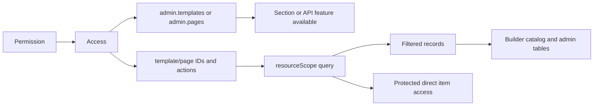

# Radlink Project Agent Handoff

Last reviewed: 2026-06-29
Workspace: `D:\Next\radlink`

## Purpose

This document is the durable context for another coding agent continuing work on Radlink. It summarizes the architecture, major features implemented during the current development thread, important files, runtime behavior, access-control rules, known risks, and recommended verification steps.

## Current Repository State

- The workspace currently has an intentionally dirty worktree containing both
  user changes and the implementation work summarized in this document.
- Do not assume a dirty file belongs to the current task, and never revert it
  unless the user explicitly requests that operation.
- Run `git status --short` at the beginning of each task and preserve all
  unrelated changes.
- Recent relevant commits:
  - `7b4001a edit ui ux`
  - `48b7732 bugs and authorize`

## Technology Stack

- Next.js `16.2.6` with App Router
- React `19.2.4`
- TypeScript
- MongoDB and Mongoose `8.24`
- SWR `2.4`
- Zustand
- Tailwind CSS `4`
- `@dnd-kit/*` for builder drag-and-drop
- `qrcode` for local, non-expiring QR generation
- AWS SDK S3 client for Liara Object Storage
- `react-multi-date-picker` and Persian calendar support
- JWT authentication with `auth_token` stored in `localStorage`

Important repository rule: before changing Next.js behavior, read the relevant documentation under `node_modules/next/dist/docs/` because this project uses a version with breaking changes.

## High-Level Architecture

```mermaid
flowchart TD
  Browser[Admin or Builder UI] --> Token[auth_token]
  Token --> Me[/api/auth/me]
  Me --> AccessHook[useAccess / AdminAuthContext]
  AccessHook --> AdminUI[Admin sections and DynamicTable]
  AccessHook --> BuilderGuard[Builder authorization]

  AdminUI --> API[App Router API routes]
  BuilderGuard --> API
  API --> Compose[compose + auth middleware]
  Compose --> AccessRules[Global access rules]
  AccessRules --> Mongo[(MongoDB)]

  Registry[blockRegistry.ts] --> Sync[/api/blocks/sync]
  Sync --> BlockDB[(Block documents)]
  BlockDB --> Builder[PageBuilder block availability]

  Builder --> PageAPI[/api/pages]
  Builder --> TemplateAPI[/api/templates]
  PageAPI --> QRService[Local QR generation]
  QRService --> QRDB[(QR documents)]

  UploadUI --> UploadAPI[/api/uploads]
  UploadAPI --> Liara[Liara Object Storage]
  UploadAPI --> FileDB[(File documents)]
```

## Authentication and Global Authorization

### Core Files

- `contexts/AdminAuthContext.tsx`
  - Protects `/admin`.
  - Reads `auth_token`, loads the current user, and redirects unauthenticated users to `/auth`.
  - Shows a Persian toast explaining the redirect.

- `contexts/UserContext.tsx`
  - Shared current-user state.
  - Profile updates must refresh this context so names, phone numbers, and avatar data update without logout/login.

- `hook/auth/useAccess.ts`
  - Client-side access API.
  - Exposes `can(component, action)`, `canOnResource(resource, id, action)`, `isSuperAdmin`, current user, and loading/error state.
  - `superAdmin` always has full access.

- `lib/auth/compose.ts`
  - Central API route composition.
  - Runs middleware and global access enforcement before route handlers.

- `lib/auth/middlewares.ts`
  - Database, authentication, status, role, agent, and explicit permission middleware.

- `lib/auth/accessCatalog.ts`
  - Static component catalog and supported actions.
  - Main actions are `view`, `create`, `update`, `delete`, and `publish`.

- `lib/auth/accessRules.ts`
  - Maps API paths and HTTP methods to component/action requirements.
  - Add every new protected API feature here.

- `lib/auth/enforceAccess.ts`
  - Authoritative global request decision.
  - Returns Persian `401/403` responses with required-access metadata.

- `lib/auth/resolveUserAccess.ts`
  - Resolves permissions and accesses into a flat runtime access map.

- `lib/auth/accessCache.ts`
  - TTL cache for resolved user access.
  - Permission/access mutations must invalidate affected users.

### Data Model

- `models/access.ts`
  - Reusable access rule document.
  - Supports static components and dynamic resources.
  - Dynamic resource groups: templates, blocks, and pages.

- `models/permission.ts`
  - Groups access documents.
  - Tracks `assignedToUsers`, `grantedBy`, and `isActive`.

- `models/users.ts`
  - Stores permission IDs in `permissions`.

### Required Behavior

- Frontend checks improve UX, but backend checks are authoritative.
- `superAdmin` bypass must remain centralized and unrestricted.
- Static component rules control screens and UI-only components such as sidebar items.
- Dynamic rules control individual page, template, and block records.
- All access errors shown to users should be Persian and explain the denied action.

Full access-system documentation already exists in:

- `docs/ACCESS_PERMISSION_SYSTEM.md`

## Admin Routing and Shell

- `app/admin/page.tsx`
  - Wraps the admin app in `AdminAuthProvider`.
  - Lazy-loads admin sections.
  - Routes the current hash section to its component.

- `hook/admin/useHashRoute.ts`
  - Defines all `AdminSection` keys and section metadata.
  - Current implemented sections include dashboard, users, agents, permissions, accesses, pages, templates, blocks, categories, QR codes, tickets, notifications, and profile.

- `components/admin/AdminShell.tsx`
  - Sidebar, header, responsive admin layout, current-user display, logout flow, and notifications dropdown.
  - All admin sections except the authenticated user's profile require explicit
    `admin.<section>:view`; role minimums are no longer a visibility bypass.
  - `superAdmin` retains the global bypass.
  - If `/admin` resolves to an unauthorized hash/default dashboard, the shell
    selects the first allowed section instead of mounting forbidden content.
  - Uses real notification data through SWR.
  - Listens for the `admin-profile-updated` browser event to update name/phone/avatar immediately.

## DynamicTable

- `components/global/DynamicTable.tsx`
- `types/table.ts`
- `hook/table/useTableData.ts`

Important behavior:

- Reusable CRUD table with view/create/edit/delete modals.
- Supports SWR data loading, pagination, search, sort, filters, date filters, export, mobile cards, copy, and custom row actions.
- Built-in create/update/delete controls are access-aware.
- Delete actions use the table confirmation modal.
- Filter dropdowns display Persian `label` values while retaining English/backend `value` values.
- Boolean option mappings use values such as `"true"` and `"false"` while showing Persian text.
- Column filters support exact dropdowns by default, `filterType: "text"` for
  contains-based text input, and `filterSearchable: true` for a searchable
  `CustomSelect`.
- Checkbox fields remain checkboxes even when `options` are supplied for filter labels.
- Nested keys such as `limits.files` are supported through `getNestedValue`.
- Avoid rendering a `<div>` from a column renderer where DynamicTable wraps content in `<p>`; use a `<span>` root to prevent hydration errors.

## Admin Sections

### Users

- `components/admin/UsersSection.tsx`
- `app/api/users/route.ts`
- `app/api/users/[id]/route.ts`
- `models/users.ts`

Implemented behavior:

- User CRUD with Persian role/status labels.
- Role and status editing follows access and super-admin rules.
- `createdBy` and `updatedBy` are populated and shown as user labels instead of raw IDs.
- Agent selection loads `/api/agents?limit=100` and appears as a clearable `CustomSelect`.
- Empty agent selection sends `""`; the PATCH route uses `$unset` to remove `agentid`.
- User limits are edited through three numeric inputs:
  - `limits.files`
  - `limits.blocks`
  - `limits.pages`
- The display-only `limits` summary is not editable, preventing `[object Object]`.
- Create/update payloads rebuild the nested `limits` object.
- `0` means unlimited. The obsolete `landingPages` field was removed from both
  user and agent limit contracts.
- Display-only permissions are removed from update payloads to avoid ObjectId validation failures.
- System-driven fields are read-only and absent from edit forms:
  - `lastLoginAt`
  - `lastOtpRequestAt`
  - `phoneVerifiedAt`
  - `createdAt`
  - `updatedAt`
  - `isPhoneVerified`
  - `isDeleted`

Known model issue:

- `models/users.ts` currently declares `agentid` with `ref: "User"`.
- Agent creation stores an Agent document ID in `agentid`.
- The UI follows the current API behavior and uses Agent IDs.
- A future cleanup should change the model reference to `ref: "Agent"` and verify existing database values before migration.

### Agents

- `components/admin/AgentsSection.tsx`
- `app/api/agents/route.ts`
- `app/api/agents/[id]/route.ts`
- `app/api/agents/[id]/toggle/route.ts`
- `models/agent.ts`

Implemented behavior:

- Full admin CRUD.
- Personal/company type handling.
- User association.
- Three synchronized limits (`files`, `blocks`, and `pages`) plus the existing
  `pricePerLanding` commercial field.
- Active/inactive power toggle with refreshed data.
- Persian filter labels.

### Accesses and Permissions

- `components/admin/AccessesSection.tsx`
- `components/admin/PermissionsSection.tsx`
- `app/api/accesses/*`
- `app/api/permissions/*`

Implemented behavior:

- Access create/update/delete.
- Static component and action selection.
- Dynamic page/template/block selection.
- Access duplication creates a new database document rather than mutating the source.
- Permission duplication creates a new active Permission through `POST`,
  copies its Access and assigned-user relationships, gives it a visible
  `(کپی)` name suffix, and records the current operator as `grantedBy`.
- Active/inactive toggle.
- Permission creation/update/deactivation and user assignment.
- Populated assigned users, granting user, and access documents.
- Cache invalidation after relationship changes.

### Categories and Templates

- `components/admin/CategoriesSection.tsx`
- `components/admin/TemplatesSection.tsx`
- `app/api/categories/*`
- `app/api/templates/*`
- `models/category.ts`
- `models/template.ts`

Implemented behavior:

- Category CRUD using DynamicTable.
- One category can contain multiple templates.
- Categories have an `isActive` state with an access-gated power toggle.
- Old categories without `isActive` are treated as active.
- Inactive categories are excluded from template options and SmartSuggestions;
  their templates cannot be selected through direct catalog, template, or page
  save requests.
- Templates populate category and block references.
- Template active/inactive power toggle.
- Template builder supports category selection and thumbnail upload.
- Category options are cached in the builder to avoid repeated requests and 403 loops.
- Models required by Mongoose populate must be imported before querying; this was necessary to avoid `MissingSchemaError` for `Block`.

### Blocks

- `builder/blocks/blockRegistry.ts`
- `models/blocks.ts`
- `app/api/blocks/sync/route.ts`
- `app/api/blocks/route.ts`
- `app/api/blocks/[id]/route.ts`
- `components/admin/BlocksSection.tsx`
- `lib/auth/builderBlockAccess.ts`

Implemented behavior:

- Registry remains the source of React renderers and local block definitions.
- Sync route writes registry metadata, schemas, defaults, styles, and elements to MongoDB.
- Admin block table can sync registry data and activate/deactivate blocks.
- Builder loads database block availability/access and prevents unauthorized blocks from being used in page creation/update.
- Page APIs call `assertBuilderBlockAccess` so direct requests cannot save unauthorized blocks.

### Pages and QR Codes

- `components/admin/PagesSection.tsx`
- `components/admin/QRCodesSection.tsx`
- `app/api/pages/*`
- `app/api/qr/*`
- `models/pages.ts`
- `models/qr.ts`

Implemented behavior:

- Page CRUD and populated owner selection.
- Admin/super-admin owner edit uses all users in `CustomSelect`.
- A normal user sees the creator as read-only and never loads `/api/users` for
  owner options.
- The Pages table uses a text-input title filter, searchable user selector for
  creator filtering, and a Persian creation-date range filter.
- Normal-user table updates strip `owner` and `ownerId` from PATCH payloads.
  The API also treats a repeated self owner ID as a no-op while rejecting any
  attempted ownership change.
- Created timestamps are system-generated, not user input.
- Page status can be toggled between published and draft from the table.
- Edit modal includes a publish checkbox.
- Page rows show logo and favicon previews. An update-gated media modal uploads
  both through the shared Liara uploader and PATCHes only those fields.
- Builder page create/edit save state includes `logo` and `favicon`; both are
  available in the page metadata modal with upload, preview, replacement, and
  removal states.
- Public landing metadata uses the saved favicon, and the saved logo renders at
  the top of the landing header.
- Page creation generates a non-expiring QR code using the local `qrcode` library.
- QR records store the page, owner/creator, target URL, shortcode, image URL/data, and active state.
- QR admin table supports CRUD visibility and active/inactive power toggle.

### Tickets

- `components/admin/TicketsSection.tsx`
- `app/api/tickets/route.ts`
- `app/api/tickets/[id]/route.ts`
- `app/api/tickets/[id]/assign/route.ts`
- `models/tickets.ts`

Implemented behavior:

- Non-super-admin users can create tickets.
- Super admin sees all tickets; normal users see their own.
- Super admin can update status, priority, and assignee.
- Requester is read-only.
- Conversation-style modal supports replies by both staff and users.
- Reply attachments upload through `/api/uploads` and are stored in `models/files.ts`.
- `replies.author` and `replies.attachments` population is supported.
- Closed tickets cannot receive messages or attachments:
  - Composer, upload, shortcut, and send button are disabled in the UI.
  - API rejects reply payloads when status is `closed`.
  - Super admin may still change metadata or reopen the ticket.
- Ticket status/priority filters display Persian labels while retaining English values.

### Files

- `components/admin/FilesSection.tsx`
- `app/api/files/route.ts`
- `app/api/files/[id]/route.ts`
- `models/files.ts`

Implemented behavior:

- The admin `files` hash route now opens a real Files section.
- The list API explicitly registers the User model and populates each file owner.
- Uploader display falls back through full name, phone number, email, and owner ID.
- Files are sorted newest first by ObjectId.
- The table shows an image preview or file-type icon, filename, type, uploader, and storage URL.
- Uploader is a searchable table filter and creation time supports an inclusive Persian date-range filter.
- Clicking an image thumbnail opens `components/ui/ImagePreviewModal.tsx`; the same preview works in both table cells and DynamicTable's row-view modal.
- `PagesSection.tsx` reuses the image preview modal for page logos and favicons.
- DynamicTable supports per-column `renderFormField` controls; page logo and favicon edit fields use it for authenticated upload, preview, replacement, and removal instead of exposing storage URLs as text inputs.
- Page create/update APIs derive `seo.ogImage` from the final logo and `seo.canonical` from `NEXT_PUBLIC_APP_URL` plus the normalized page URL (falling back to `APP_URL` or the request origin).
- All 13 admin DynamicTable sections use backend pagination with a 20-row default. DynamicTable sends `page` and `limit`, reads each API's `total`, and requests subsequent records only when the user changes pages; it no longer relies on fetching the first 100 records for client-only pagination.
- Builder URL controls use `builder/editor/form/LinkTypeHelp.tsx` in both normal content fields and repeater fields. The adjacent question-mark control opens on hover, click, or focus and documents web, internal, anchor, telephone, SMS, email, WhatsApp, Telegram, and geo link formats.
- Public pages register every load/refresh as a view through `POST /api/pages/[id]/view`. `PageRenderer` uses a page-specific localStorage marker so `stats.visitors` increments only for a new browser/page pair, while an in-memory pending guard prevents React Strict Mode duplication. The API updates published pages atomically, and PagesSection displays and sorts both counters.
- New pages default to `isPublished: true` in both the Page schema and POST API, with `publishedAt` set on creation. An explicit `isPublished: false` payload can still create a draft.
- Users with view access can open the stored file in a new tab.
- Users with delete access can delete through DynamicTable's confirmation modal.
- The API remains ownership-aware: admins can see all files and non-admin users see their own.

### Products

- `components/admin/ProductsSection.tsx`
- `app/api/products/route.ts`
- `app/api/products/[id]/route.ts`
- `models/products.ts`

Implemented behavior:

- The admin `products` hash route now opens a full CRUD Products section.
- Product fields include name, description, non-negative price, image URLs, and system timestamps.
- Image URLs are edited as one URL per line and normalized to a unique `string[]`.
- The table shows the main image, image count, description, price, image previews, and creation date.
- Product actions are gated by `admin.products` create/update/delete/view access.
- Product API inputs are trimmed and validated with Persian errors.
- Invalid product IDs return a controlled `400` response instead of a Mongoose cast error.

### Notifications

- `components/admin/NotificationsSection.tsx`
- `app/api/notifications/route.ts`
- `app/api/notifications/[id]/route.ts`
- `models/notification.ts`

Implemented behavior:

- Notification CRUD through DynamicTable.
- Notifications target one Page or all pages through `isGlobal`.
- Supports `info` and `danger`, title, subtitle, description, closeable state,
  and active state.
- Global/page-specific, closeable, type, and active filters use Persian labels.
- Create/edit forms expose `isActive`; the table has an independent power
  toggle with loading state and refresh.
- Public landing pages, the AdminShell dropdown, and dashboard counts only
  consume records where `isActive !== false`.
- The management table passes admin-only `includeInactive=true` so inactive
  records remain available for reactivation.
- Existing records without `isActive` are treated as active for backward
  compatibility.
- Notification mutations invalidate the header and dashboard SWR caches.

### Dashboard

- `components/admin/DashboardSection.tsx`
- `hook/admin/useDashboardStats.ts`
- `app/api/admin/dashboard/route.ts`

Implemented behavior:

- `admin.dashboard:view` controls access to the default dashboard.
- Cards, mini statistics, and quick actions are filtered by each target
  component's static access.
- Create-oriented quick actions require both target `view` and `create`.
- The API only executes database queries for sections the user can view.
- Personal resources are owner/resource scoped for non-admin users.
- Aggregates permitted counts:
  - users
  - blocks
  - pages
  - templates
  - open/in-progress tickets
  - agents
  - QR codes
  - other available admin metrics
- Recent users and recent tickets are queried and rendered only for
  `superAdmin`.
- Uses token-keyed SWR caching with a one-minute deduplication interval to avoid
  a database request on every render.
- Dashboard greeting listens for live profile updates.

### Profile

- `components/admin/ProfileSection.tsx`
- `app/api/auth/me/route.ts`
- `contexts/UserContext.tsx`

Implemented behavior:

- Dedicated profile UI rather than DynamicTable.
- Reads authenticated user data from `/api/auth/me`.
- User can edit allowed profile fields.
- Avatar uses a designed file input and `/api/uploads`.
- Successful profile edits update SWR, UserContext, AdminShell, and Dashboard without requiring logout/login.
- Uses the `admin-profile-updated` custom event for cross-component synchronization.

## Builder

### Entry Points

- `app/builder/page.tsx`
  - URL-driven page/template creation and template editing.
  - Supports query parameters such as `mode=template` and `templateId`.
  - Brand-new page creation without `templateId` now pauses before mounting
    `PageBuilder` and opens the categorized template-start modal.
  - Selecting a template reuses the existing `initialBlocks` and
    `sourceTemplateId` hydration path.
  - Selecting a blank page mounts the existing builder with an empty canvas.

- `app/builder/[pageId]/page.tsx`
  - Existing page editing.

- `hook/auth/builderAuthorization.ts`
  - Shared builder guard.
  - Missing/invalid token redirects to `/auth` with an authentication toast.
  - Valid token without access redirects to `/admin` with a permission toast.
  - Supports broad builder access and dynamic page/template update access.

### Main Editor

- `builder/SmartSuggestions.tsx`
  - Database-backed, required first-step modal for new page creation.
  - Shows categories and filters active templates by category.
  - Loads the selected template only when clicked.
  - Provides a blank-page path even when the catalog request fails.
  - Preserves the previous static quick suggestions as
    `LegacySmartSuggestions`.

- `app/api/builder/template-catalog/route.ts`
  - Authenticated catalog endpoint dedicated to page creation.
  - Requires `builder.page:create` unless the user is `superAdmin`.
  - Returns active categories and active templates.
  - Filters templates against the user's allowed active blocks.
  - Returns full template data only for the selected template.

- `builder/editor/PageBuilder.tsx`
  - Main create/edit logic for pages and templates.
  - Loads templates/pages, database block availability, and category options.
  - Saves page or template based on mode.
  - Generates QR after page creation.
  - Tracks unsaved state and leave confirmation.
  - Updates document title/meta description based on create/edit and page/template mode.

- `builder/BuilderModals.tsx`
  - Save/create modal UI.
  - Page title and meta description.
  - Template category selection.
  - Thumbnail upload with validation, loading state, preview, error handling, and URL fallback.

- `builder/editor/PhoneLivePreview.tsx`
  - Uses an iframe/portal-based document so mobile media queries evaluate against a genuinely narrow viewport.
  - Scroll remains functional.
  - Scrollbars are hidden in Firefox and WebKit.

### Block Rendering and Authorization

- `builder/blocks/blockRegistry.ts`
  - Maps block type to renderer, schema, defaults, category, icon, and metadata.

- `builder/blocks/contact-save/contactSave.default.ts`
- `builder/blocks/contact-save/contactSave.schema.ts`
- `builder/blocks/contact-save/ContactSaveBlock.tsx`
  - Defines the `contactSave` block.
  - Generates a UTF-8 vCard 3.0 `.vcf` contact containing first name, last name, mobile number, and optional organization.
  - Converts Persian and Arabic phone digits to ASCII.
  - Uses a downloadable/openable `text/vcard` data link for iOS and Android compatibility.
  - Supports editable button text, icon visibility, and container/button/icon styles.
  - Requires the existing Admin Blocks sync action before it appears in the database-driven builder catalog.

- `lib/auth/builderBlockAccess.ts`
  - Resolves which database blocks a user may use.

- `app/api/pages/route.ts`
- `app/api/pages/[id]/route.ts`
  - Enforce authorized block use during create and update.

## File Uploads and Liara

- `app/api/uploads/route.ts`
- `lib/s3.ts`
- `models/files.ts`

Behavior:

- Authenticated multipart upload.
- File type and 10 MB size validation.
- Non-ASCII filenames receive generated ASCII-safe object keys.
- Uploads to Liara through AWS S3 SDK.
- Creates a File document with owner, original filename, and public path.
- Returns both top-level `url` and detailed file metadata.
- Handles common Liara errors with Persian messages.

Required environment variables:

- `LIARA_BUCKET_NAME`
- `LIARA_ENDPOINT`
- `LIARA_ACCESS_KEY`
- `LIARA_SECRET_KEY`
- Optional public URL:
  - `LIARA_PUBLIC_URL`
  - `NEXT_PUBLIC_LIARA_PUBLIC_URL`

Known deployment issue:

- `ECONNREFUSED 10.10.34.35:443` is an endpoint/network configuration problem, not a browser upload bug.
- `LIARA_ENDPOINT` must match the SDK endpoint from the Liara bucket panel and must be reachable from the Next.js server runtime.
- `GET /api/uploads` reports current upload configuration readiness.

## Models and Their Main Responsibilities

- `models/users.ts`: users, roles, status, permissions, limits, verification and audit fields.
- `models/agent.ts`: agent profile, type, company data, pricing, limits, active state.
- `models/access.ts`: static and dynamic action rules.
- `models/permission.ts`: access grouping and user assignment.
- `models/category.ts`: template categories.
- `models/template.ts`: builder template content, blocks, category, thumbnail, active state.
- `models/blocks.ts`: synchronized block definition and active state.
- `models/pages.ts`: created pages, owner, template, blocks, SEO/settings, publish state.
- `models/qr.ts`: generated page QR records.
- `models/tickets.ts`: requester, assignee, status, priority, replies, attachments.
- `models/files.ts`: uploaded file metadata and ownership.
- `models/notification.ts`: page-targeted or global landing notifications,
  presentation type, closeability, and active state.
- `models/products.ts`: product data and API-backed admin feature.

## UI and Localization Rules Established

- Admin-facing labels and errors are Persian.
- Backend enum values remain English.
- DynamicTable filters use Persian labels with original English values.
- Use `CustomSelect` for relational fields.
- Use power icons for active/inactive table actions.
- Refresh table data after successful toggles.
- Use DynamicTable's confirmation modal for deletes.
- Avoid nested block elements inside `<p>` wrappers to prevent hydration errors.
- Dates and audit fields must be generated by system behavior, not manually entered.

## Known Risks and Cleanup Opportunities

1. Fix the `agentid` Mongoose reference mismatch after reviewing production data.
2. Several source files contain mojibake in comments or strings when displayed through some Windows shell encodings. Confirm actual UTF-8 file content before rewriting text.
3. The upload route still contains debug `console.log` statements that may be removed after storage configuration is stable.
4. `graphify-out/` and `.claude/` were committed in a recent change and are large; decide separately whether they belong in the repository.
5. Run full browser testing for access combinations, especially static view-only access plus dynamic resource update access.
6. Do not rely only on frontend visibility checks; every new route must be mapped and enforced on the backend.

## How to Add a New Admin Feature

1. Create or update the Mongoose model.
2. Add composed API routes with `withDB`, `withAuth`, and relevant status/role checks.
3. Add the component key to `lib/auth/accessCatalog.ts`.
4. Map API paths and methods in `lib/auth/accessRules.ts`.
5. Add the section key and metadata to `hook/admin/useHashRoute.ts`.
6. Add lazy loading and routing in `app/admin/page.tsx`.
7. Add permission-aware sidebar visibility in `AdminShell`.
8. Build the section with DynamicTable or a dedicated UI.
9. Use Persian labels/errors while preserving backend enum values.
10. Verify as super admin, view-only user, update-only dynamic resource user, and unauthorized user.

## Verification Checklist

Run:

```powershell
cmd /c npx tsc --noEmit
cmd /c npm run lint
cmd /c npm run build
```

Then manually verify:

- `/admin` without a token redirects to `/auth` with a Persian toast.
- `/builder` without a token redirects to `/auth`.
- `/builder` with a token but without permission redirects to `/admin`.
- Super admin can perform all actions.
- View-only users cannot create, edit, delete, publish, or toggle.
- Access and permission edits invalidate cached permissions.
- Closed tickets reject replies and attachments in both UI and API.
- Page creation produces one valid QR record.
- Template thumbnail upload persists and reloads.
- Mobile preview uses true mobile media-query behavior and has hidden scrollbars.
- User agent select can be cleared.
- User limits save as three numbers; zero means unlimited.
- User dates do not appear in edit forms.
- `/admin` without `admin.dashboard:view` resolves the first allowed section.
- Dashboard cards and shortcuts never navigate to unauthorized sections.
- A restricted user sees only dynamically allowed templates in admin and builder
  catalogs.
- An unauthorized `templateId` cannot be used through direct page API requests.
- A normal user sees page owner data but cannot edit or submit ownership fields.
- Inactive notifications remain manageable in admin but disappear from landing,
  header dropdown, and dashboard delivery surfaces.

## 2026-06-28 Architecture Addendum

This section records the latest behavior and overrides older statements elsewhere
in this document when they conflict.

### Global User Quotas

User quota fields are now only:

- `limits.files`: maximum owned user uploads.
- `limits.pages`: maximum owned Page documents.
- `limits.blocks`: maximum blocks in one page.

`models/users.ts`, user API payloads, auth/profile types, and
`components/admin/UsersSection.tsx` and `components/admin/AgentsSection.tsx` no
longer contain `landingPages`. A value of `0` means unlimited, and `superAdmin`
is always unlimited.

Agent create/update APIs normalize the same three fields and synchronize them to
the linked User document. The global quota engine always reads User limits, so
there is no second competing runtime quota source.

`lib/auth/quota.ts` is the central server policy. It calculates structured quota
status and produces a Persian `403` response with code `QUOTA_EXCEEDED`.

Enforcement boundaries:

- `app/api/uploads/route.ts` checks before writing to Liara.
- File usage counts only `File.kind === "upload"`; generated QR files do not
  consume upload quota.
- `app/api/pages/route.ts` checks page quota for the actual target owner and
  validates the final per-page block count.
- `app/api/pages/[id]/route.ts` checks the page owner's block quota before full
  builder updates.
- `app/api/pages/[id]/blocks/route.ts` checks before incremental block adds.
- `builder/editor/PageBuilder.tsx` provides early feedback for add, duplicate,
  drag-in, and applying a template. Server checks remain authoritative.

Deleting an uploaded File or Page frees quota because usage is calculated from
current database records.

### Page and Template Backgrounds

Both `models/pages.ts` and `models/template.ts` persist:

```ts
background: {
  color: string;
  image: string;
}
```

The APIs validate hex colors and HTTP(S) image URLs. Existing template
`style.colors.background` and `style.bgImage` values are supported as legacy
fallbacks.

There is one effective background in builder state:

- Blank page/template: white default.
- Edited page: its own saved background.
- Edited template: its saved background.
- Page created from a template: a copy of the selected template background.

After template selection, the page owns the copied values. Public rendering never
stacks template and page backgrounds. `builder/BuilderCanvas.tsx`,
`builder/editor/PhoneLivePreview.tsx`, and the public `app/[url]/page.tsx` route
render the same effective background. Public landing images use a fixed
full-viewport layer with `cover`.

`builder/BuilderModals.tsx` provides color and Liara image controls for both page
and template modes. Background uploads use the shared authenticated uploader and
therefore create owner-linked File records.

### Upload Architecture

All persistent client uploads should use `lib/fileUtils.ts#uploadFile` and
`POST /api/uploads`. Covered surfaces include:

- Profile avatars
- Ticket attachments
- Template thumbnails
- Page/template backgrounds
- Page logos and favicons
- Generic builder image and video fields
- Repeater/product-card media

The route uploads to Liara, then creates `models/files.ts` with authenticated
owner, MIME type, size, and `kind: "upload"`. If database creation fails after
the S3 write, the object is removed. Do not persist browser `blob:` URLs.

Generated page QR PNG files use `kind: "qr"`, carry creator/page references, and
do not consume the user upload quota.

### Builder UX and Save Flow

- Database blocks show skeleton loading states in the sidebar and catalog modal.
- `DynamicIslandPanel` content/style popovers grow for dense schemas, remain
  viewport-constrained, and scroll internally.
- Save labels distinguish page/template create/edit modes.
- Page create/update displays a response modal. Successful saves provide a safe
  `target="_blank"` public-page link.
- The AdminShell header exposes a `/builder` shortcut controlled by
  `builder.page:create`; its catalog label is "ساخت صفحه از ادمین".
- Browser back navigation away from `/builder` must update both URL and UI.

### Category and Template Relationship

`Template.category` is the authoritative relation. Category list/single APIs
derive template names and `templateCount` from Template documents rather than
trusting the historical `Category.templates` array, which may be stale.

### Notifications and Public Landing

Notifications target one page or use `isGlobal` for all pages. They support
`info` and `danger`, custom title/subtitle/description, and closeable or blocking
behavior. Public landing data must be converted to plain serializable values
before passing from Server Components to Client Components.

### Verification Additions

- Finite file quota blocks the next user upload with `QUOTA_EXCEEDED`.
- Finite page quota blocks the next page creation.
- Finite block quota blocks builder additions and direct API saves.
- Zero limits remain unlimited.
- Template selection copies, rather than overlays, its background.
- Category rows show names and counts from `Template.category`.

### Owner-Scoped Admin Resources

`lib/auth/ownership.ts` is the shared ownership policy for personal resources.
Only `admin` and `superAdmin` receive global data scope. Users and agents are
always restricted to their own records, even when they have static `view`,
`update`, or `delete` access to the corresponding admin component.

This policy is applied to list and item operations for:

- Pages through `app/api/pages/*`
- Files through `app/api/files/*`
- QR codes through `app/api/qr/*`

Permissions determine whether a user may perform an action; ownership determines
which records that action may target. Do not treat a granted component access as
global data visibility.

## 2026-06-29 Access and Delivery Addendum

This section overrides older access, dashboard, page/template visibility, and
notification-delivery statements when they conflict.

### Static Admin Navigation

`components/admin/AdminShell.tsx` no longer uses `SectionMeta.minRole` as an
implicit permission grant. The role metadata still organizes role-oriented
mobile navigation, but visibility requires:

```text
profile
OR superAdmin
OR admin.<section>:view
```

This rule is applied to the desktop sidebar and mobile dynamic island. The
notification bell separately requires `admin.notifications:view`, so the
dropdown does not mount or fetch when access is absent.

The shell waits for the shared `/api/auth/me` SWR request before mounting section
content. If the URL points to an unauthorized section, including the default
dashboard, it resolves the first allowed `SECTION_META` entry and synchronizes
the hash. Profile is the final authenticated fallback.

`admin.dashboard` already exists in `lib/auth/accessCatalog.ts`; assign its
`view` action in `components/admin/AccessesSection.tsx` when a non-super-admin
should use the default dashboard.

### Dynamic Page and Template Scope

`lib/auth/resourceScope.ts` is the central server-side record-scope helper:

- `getGrantedResourceIds(user, resource, action)` resolves dynamic IDs.
- `withTemplateAccessScope` creates a template allowlist query.
- `withPageAccessScope` creates an `owner OR explicitly granted resource` query.
- `admin` and `superAdmin` receive global record scope.
- `user` and `agent` receive restricted scope.

Dynamic template access is an allowlist, not a deny-list. For a non-global role,
only templates with dynamic `view` are visible or usable. A typical page-builder
user needs:

```text
admin.dashboard:view              optional, only for dashboard entry
admin.pages:view/create           page administration
builder.page:create               enter page creation
admin.templates:view              template section/list access when needed
templates.<templateId>:view       one entry per usable template
blocks.<blockId>:view              one entry per usable block
```

The exact access document schema stores those last two entries in
`dynamicAccess.templates[]` and `dynamicAccess.blocks[]`.

Enforcement points:

- `GET /api/templates` filters the collection.
- `GET /api/templates/[id]` filters direct reads.
- `GET /api/builder/template-catalog` returns only allowed active templates
  whose blocks are also allowed.
- The builder catalog returns only categories containing an available template.
- Page create/update validates a submitted `templateId`; manually posting an
  unauthorized ID returns a controlled not-found/forbidden-style response.
- Page list/item routes use owner-or-dynamic scope for `view`, `update`, and
  `delete`.

The collection's static access and the record's dynamic access serve different
purposes: static access exposes the feature; dynamic access selects records.
Frontend filtering is only UX. The API query scope is authoritative.



### Access-Aware Dashboard

`app/api/admin/dashboard/route.ts` resolves the user's access once and conditionally
creates queries. It does not run all count/aggregation queries for every user.

Data rules:

- Users and agents are counted only with their corresponding static `view`.
- Templates and blocks use dynamic allowlists for restricted roles.
- Pages use `withPageAccessScope`, including owner and explicitly granted pages.
- Files and QR codes use owner scope outside admin/super-admin.
- Tickets are requester-scoped outside `superAdmin`.
- Recent users and recent tickets are never queried or returned for a
  non-super-admin.
- Only active notifications contribute to the notification count.

`components/admin/DashboardSection.tsx` independently filters:

- Main cards by target component `view`.
- Mini stats by target component `view`.
- Quick links by `view`, plus `create` for create-oriented shortcuts.
- Recent-user and recent-ticket panels by `isSuperAdmin`.

`hook/admin/useDashboardStats.ts` keeps the response token-specific in SWR,
disables focus/reconnect revalidation, and deduplicates for 60 seconds.

### Notification Active State

`models/notification.ts` now persists:

```ts
isActive: boolean // default true
```

Delivery uses `{ isActive: { $ne: false } }`, deliberately treating old
documents without the field as active. Do not change this to `{ isActive: true }`
without first migrating existing records.

Relevant behavior:

- `POST /api/notifications` accepts `isActive`, defaulting to true.
- `PATCH /api/notifications/[id]` can toggle `isActive`.
- Normal notification GET requests return active records only.
- Admin/super-admin may request `includeInactive=true` for management.
- Non-admin direct reads cannot expose inactive notifications.
- `app/[url]/page.tsx` filters inactive page/global notifications before passing
  plain data to `PageNotificationModal`.
- `components/admin/NotificationsSection.tsx` exposes a form checkbox, status
  badge/filter, and access-gated power button.
- Toggling refreshes the table and invalidates the AdminShell notification and
  dashboard caches.
- Revalidation of `"/[url]"` keeps public landing output consistent.

### Authenticated Navbar CTA

`components/global/navbar.tsx` reads authenticated state through
`contexts/UserContext.tsx` and the local `auth_token` fallback. Its primary CTA
routes authenticated users to `/admin`; unauthenticated users continue to the
authentication route.

### Latest Verification

The access-aware dashboard, dynamic template/page scoping, page-owner form
behavior, and notification active-state work were verified on 2026-06-29 with:

```powershell
npx tsc --noEmit
npx eslint <focused changed files>
npm run build
```

The Next.js `16.2.6` production build completed successfully.

## Recommended Starting Point for the Next Agent

1. Read `AGENTS.md`.
2. Read this document.
3. Read `docs/ACCESS_PERMISSION_SYSTEM.md`.
4. Run `git status --short` and preserve unrelated user changes.
5. Read local Next.js docs for the exact feature being changed.
6. Run TypeScript before and after modifications.
7. Test both frontend gating and direct API requests.

---

############ PROMT FOR CHANGE THE DEFAULT COLORS ####################
Review every `*.default.ts` file inside `builder/blocks/` and unify ONLY the default color values across all blocks.

Use only this complementary color palette:

- Primary: `#064789`
- Secondary: `#427AA1`
- Light/background: `#EBF2FA`

Rules:

1. Change ONLY color-related values:
   - `color`
   - `backgroundColor`
   - `borderColor`

2. Do NOT change, add, remove, rename, reorder, or refactor anything else.

3. Do NOT modify:
   - Data/content
   - Text
   - Types
   - Functions
   - Imports/exports
   - Element names
   - `allowedStyleKeys`
   - Font sizes
   - Border widths
   - Border radiuses
   - Animations
   - Responsive breakpoints
   - Settings
   - Block structure
   - Registry
   - Schema files
   - Component files

4. Preserve all responsive objects and their existing keys exactly. Replace only their color values.

5. Use the palette consistently:
   - `#064789` for primary text, strong surfaces, and important actions.
   - `#427AA1` for secondary actions, accents, icons, and borders.
   - `#EBF2FA` for light backgrounds and soft surfaces.
   - White may be used only when required for readable text on `#064789` or `#427AA1`.
   - Transparent values may remain transparent where necessary.

6. Maintain accessible contrast between foreground and background colors.

7. Do not introduce gradients or any additional colors.

8. Do not alter existing logic or behavior.

9. After editing, run:
   - `npx tsc --noEmit`
   - Focused ESLint on the modified default files.

The final diff must contain color-value replacements only. If any non-color change appears, revert it.
