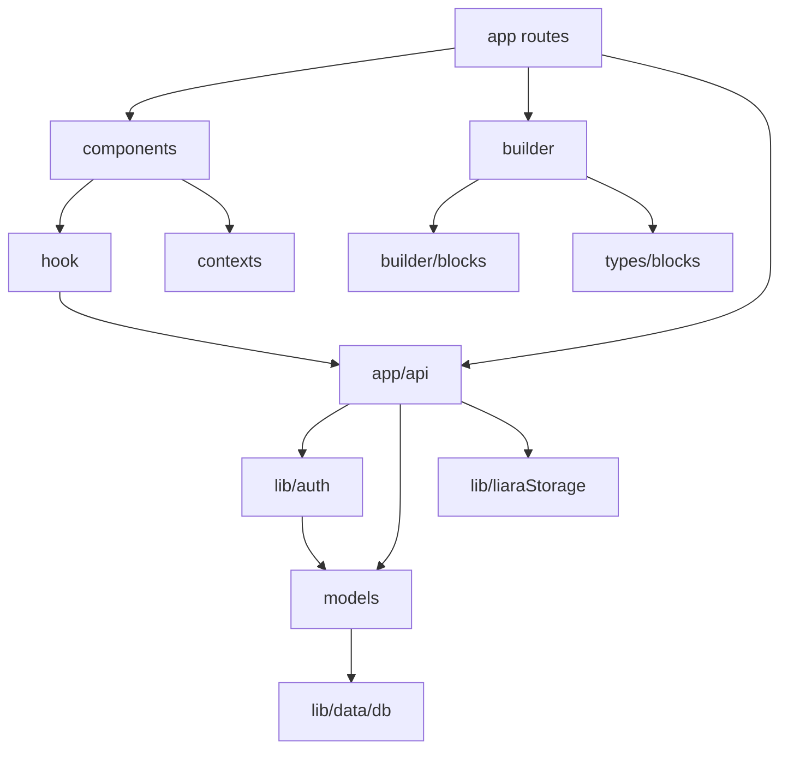
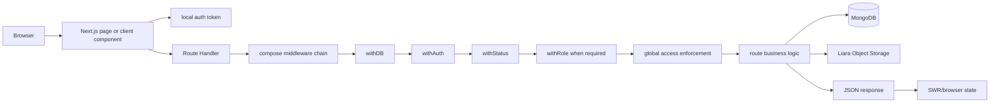
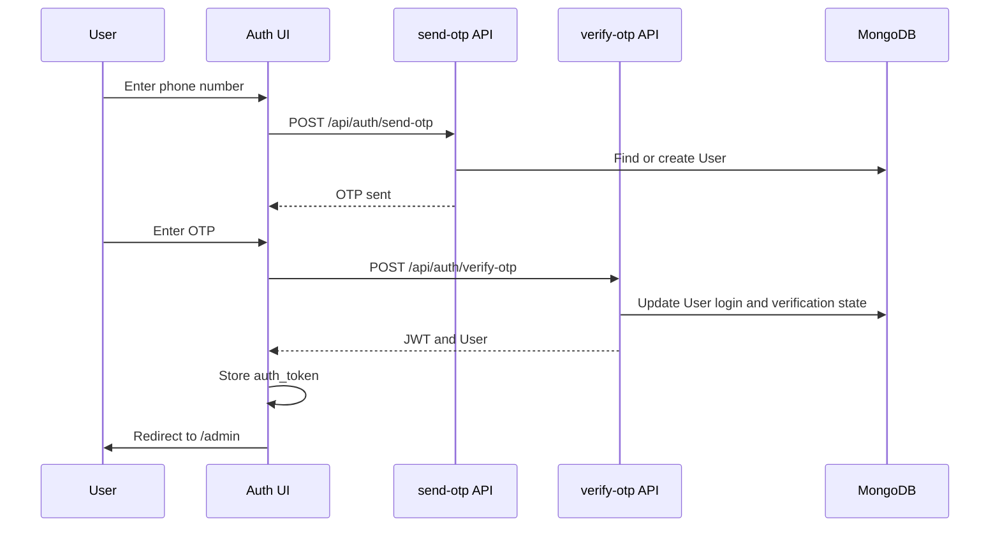
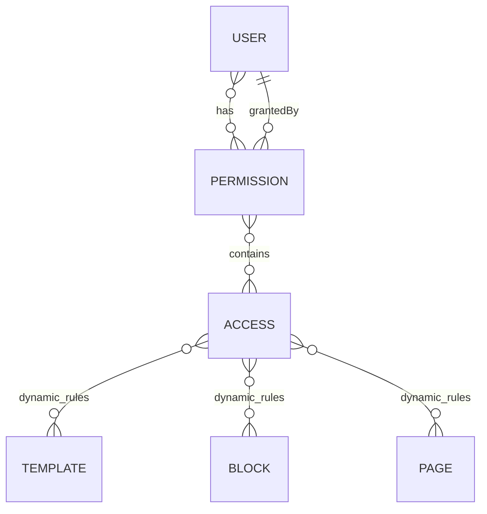
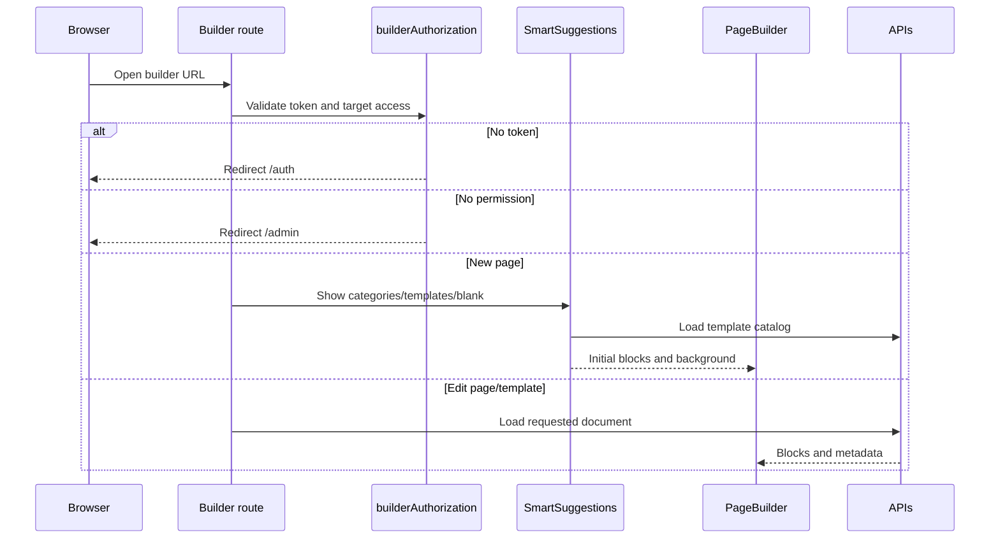
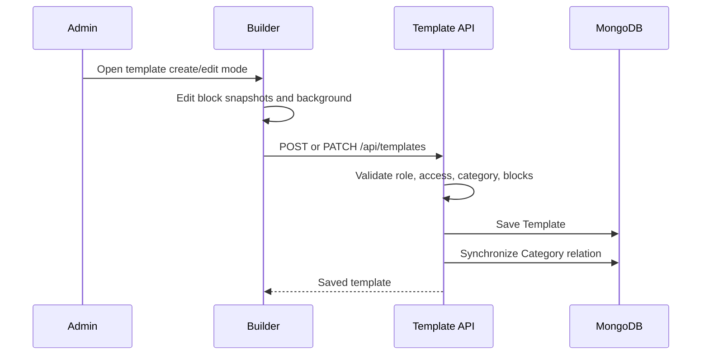
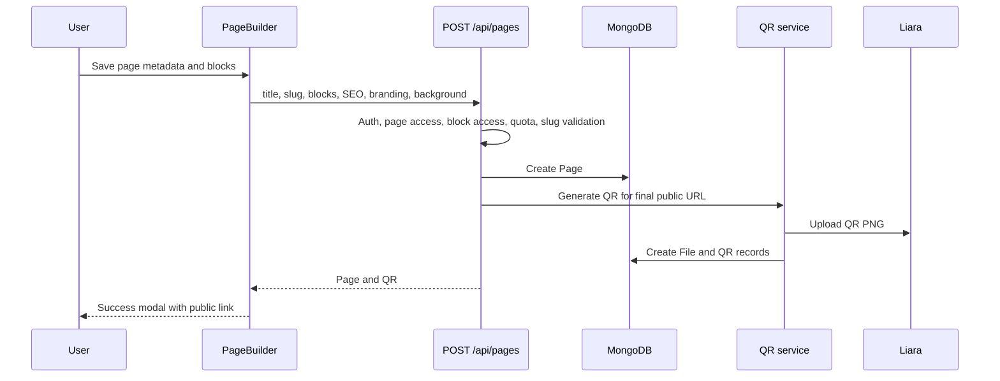
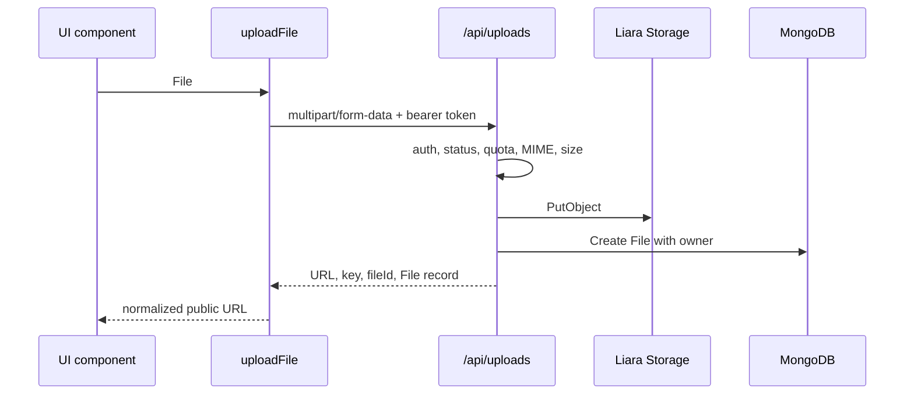
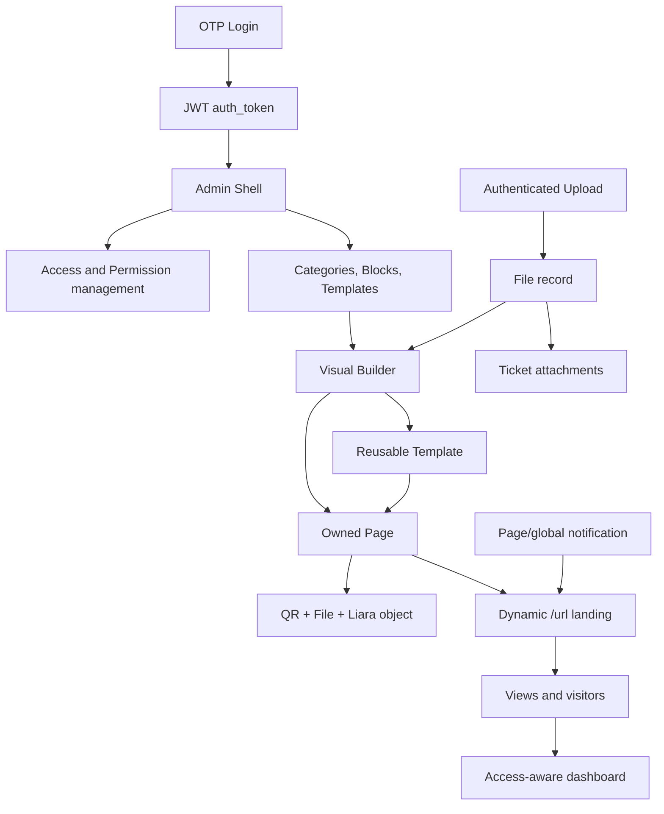

# Radlink Complete Project Guide

## Purpose

This document is the primary technical map of the Radlink repository.

It explains:

- how the application starts;
- how browser requests move through the frontend, API, authorization layer, database, and object storage;
- how users, agents, accesses, and permissions relate to one another;
- how blocks, categories, templates, pages, files, QR codes, notifications, and tickets are created and used;
- which files own each important responsibility;
- how to add a new admin module, API resource, builder block, or protected feature.

The more focused documents in `docs/` remain useful deep-dive references. This guide connects them into one end-to-end system description.

---

## 1. Technology Stack

| Area                  | Technology                                               | Main files                                                     |
| --------------------- | -------------------------------------------------------- | -------------------------------------------------------------- |
| Application framework | Next.js 16 App Router                                    | `app/`                                                         |
| UI runtime            | React 19 and TypeScript                                  | `app/`, `components/`, `builder/`                              |
| Styling               | Tailwind CSS 4 and styled-components                     | `app/globals.css`, `lib/registry.tsx`, builder blocks          |
| Database              | MongoDB with Mongoose                                    | `lib/data/db.ts`, `models/`                                    |
| Authentication        | OTP plus JWT bearer token                                | `app/api/auth/`, `lib/auth/jwt.ts`                             |
| Authorization         | Roles, static access, dynamic resource access, ownership | `lib/auth/`, `models/access.ts`, `models/permission.ts`        |
| Client data cache     | SWR                                                      | `hook/table/useTableData.ts`, `hook/auth/useAccess.ts`         |
| Builder state         | React state, local persistence, drag and drop            | `builder/`, `@dnd-kit/*`                                       |
| Object storage        | Liara S3-compatible storage                              | `app/api/uploads/route.ts`, `lib/s3.ts`, `lib/liaraStorage.ts` |
| QR generation         | `qrcode`                                                 | `lib/qrCode.ts`                                                |
| Date UI               | Persian date libraries                                   | `react-multi-date-picker`, `react-date-object`                 |
| Icons                 | `react-icons`                                            | frontend components                                            |

---

## 2. Repository Map

```text
radlink/
├── app/                  Next.js routes, layouts, pages, and API handlers
│   ├── api/              Backend HTTP endpoints
│   ├── admin/            Hash-routed administration application
│   ├── auth/             Authentication page
│   ├── builder/          Builder entry routes
│   └── [url]/            Public dynamic landing-page route
├── builder/              Visual page/template builder implementation
│   ├── blocks/           Block registry and all block families
│   └── editor/           Canvas, editor state, forms, preview, and controls
├── components/
│   ├── admin/            Admin sections
│   ├── global/           Shared navigation and DynamicTable
│   ├── static/           Marketing and authentication UI
│   └── ui/               Shared UI primitives
├── contexts/             Authentication, theme, and user contexts
├── docs/                 Specialized and comprehensive documentation
├── helper/               Builder transformation helpers
├── hook/                 Auth, admin, builder, table, and theme hooks
├── lib/
│   ├── auth/             Server authorization system
│   ├── data/             MongoDB connection
│   └── design/           Design tokens and theme helpers
├── models/               Mongoose schemas
├── services/             Client-side API service wrappers
├── types/                Shared TypeScript contracts
├── public/               Static public assets
├── next.config.ts        Next.js image and framework configuration
└── package.json          Runtime dependencies and commands
```

### Folder Dependency Direction



---

## 3. Application Entry Points

### Root Application

`app/layout.tsx`

- Loads global CSS and the Estedad Persian font.
- Installs the custom toast system.
- installs `ThemeProvider`.
- installs `StyledComponentsRegistry` so builder blocks using styled-components render correctly with App Router.
- defines default metadata and favicon.

`app/page.tsx`

- Renders the public Radlink marketing website.
- Composes the global navbar, landing sections, CTA content, FAQ, footer, and the global dynamic island.
- It is separate from user-generated landing pages.

`app/globals.css`

- Owns global CSS, Tailwind integration, layout behavior, and reusable global styles.

### Authentication Entry

`app/auth/page.tsx`

- Hosts `components/static/auth/AuthPage.tsx`.
- Presents the OTP login flow.
- Successful authentication stores `auth_token` in browser local storage.

### Admin Entry

`app/admin/layout.tsx`

- Adds the admin theme boundary.

`app/admin/page.tsx`

- Wraps the admin application in `AdminAuthProvider`.
- loads `AdminShell`.
- lazy-loads every admin section.
- routes the active hash section to the correct section component.

### Builder Entries

`app/builder/page.tsx`

- Handles page creation, template creation, and template editing.
- reads URL parameters such as `mode` and `templateId`.
- validates builder access before loading the editor.
- loads template snapshots when a template is selected.
- opens `SmartSuggestions` before a new page starts.
- dynamically imports `builder/editor/PageBuilder.tsx` with SSR disabled.

`app/builder/[pageId]/page.tsx`

- Handles editing an existing page.
- authorizes access to the requested page.
- loads the page and passes its blocks and metadata into the builder.

### Public Dynamic Page Entry

`app/[url]/page.tsx`

- Resolves a page by its unique `url` field.
- generates page-specific metadata, favicon, Open Graph information, and page title.
- blocks unpublished pages with a non-closeable status dialog.
- loads page-specific and global notifications.
- converts Mongoose values into plain client-safe objects.
- renders the page header, logo, background, notifications, and block snapshots.

`app/[url]/PageRenderer.tsx`

- maps each stored page block to its registered React block component.
- runs in public mode so editing controls are disabled.
- updates browser icons when needed.
- records views and unique visitors.

`app/[url]/PageNotificationModal.tsx`

- renders page/global notifications.
- supports `info` and `danger` designs.
- respects the `closeable` setting.

---

## 4. High-Level Runtime Architecture



### Database Connection

`lib/data/db.ts`

- reads `MONGODB_URI`;
- creates one Mongoose connection per application process;
- stores the connection on `global` to survive development hot reloads.

Every composed API normally starts with `withDB()` from `lib/auth/middlewares.ts`.

---

## 5. Authentication Lifecycle

### Core Files

| File                                | Responsibility                                                                                                     |
| ----------------------------------- | ------------------------------------------------------------------------------------------------------------------ |
| `app/api/auth/send-otp/route.ts`    | Receives a phone number, creates a user when needed, applies OTP cooldown, and sends/stores OTP                    |
| `app/api/auth/verify-otp/route.ts`  | Reads the OTP submission, updates phone/login state, and returns JWT; see the current implementation warning below |
| `app/api/auth/me/route.ts`          | Returns the current user and resolved access map; updates the current profile                                      |
| `lib/auth/otp-store.ts`             | Current OTP storage abstraction                                                                                    |
| `lib/auth/jwt.ts`                   | JWT signing and verification                                                                                       |
| `lib/auth/middlewares.ts`           | Authentication, status, role, agent, and permission middleware                                                     |
| `contexts/AdminAuthContext.tsx`     | Browser-side admin token guard                                                                                     |
| `hook/auth/useAccess.ts`            | Fetches `/api/auth/me` and exposes access helpers                                                                  |
| `hook/auth/builderAuthorization.ts` | Builder-specific authorization and redirect decisions                                                              |

### Authentication Flow



### JWT Request Flow

1. The frontend sends `Authorization: Bearer <auth_token>`.
2. `withAuth()` verifies the token.
3. The current User is loaded from MongoDB.
4. phone verification and account status are checked.
5. the User document is attached to `req.ctx.user`.
6. role, access, ownership, and quota checks use this server-loaded user.

### Roles

`models/users.ts` defines:

- `user`
- `agent`
- `admin`
- `superAdmin`

`superAdmin` bypasses access checks. `admin` has global owner scope in resource ownership helpers. User and agent data is normally owner-scoped.

The persisted role value remains `superAdmin`, but all user-facing role labels use the branded text `R A D`. Primary role badges use the shared gold presentation from `lib/userRole.ts`.

> **Current implementation warning:** in `app/api/auth/verify-otp/route.ts`, the OTP equality and expiration checks are currently commented out. The route therefore issues a token without proving that the submitted OTP matches a live record. This is the current repository behavior, not the intended secure flow, and must be fixed before production.
>
> Security note: consult `docs/AUTH.md` and the latest security audit before production. Authentication enforcement must never rely only on frontend guards.

---

## 6. Authorization: Roles, Accesses, and Permissions

Radlink separates an individual rule set from assignment of that rule set.

### Conceptual Model



### Access

`models/access.ts`

An Access document stores:

- a required, trimmed, human-readable, unique `name`;
- static component rules, such as `admin.users` with `view`;
- template-specific actions;
- block-specific actions;
- page-specific actions;
- an active/inactive status.

Supported actions:

- `view`
- `create`
- `update`
- `delete`
- `publish`

### Permission

`models/permission.ts`

A Permission:

- has a human-readable name and description;
- references one or more Access documents;
- references assigned users;
- records the user that granted it;
- can be active or inactive.

### User Assignment

`models/users.ts`

- stores Permission references in `user.permissions`;
- Permission also stores `assignedToUsers`;
- permission routes synchronize both sides.

### Static Component Catalog

`lib/auth/accessCatalog.ts`

Defines names shown in Access management:

- `admin.dashboard`
- `admin.users`
- `admin.agents`
- `admin.permissions`
- `admin.accesses`
- `admin.pages`
- `admin.templates`
- `admin.blocks`
- `admin.categories`
- `admin.files`
- `admin.qrcodes`
- `admin.products`
- `admin.tickets`
- `admin.notifications`
- `builder.page`
- `builder.template`

### Request Mapping

`lib/auth/accessRules.ts`

- maps API prefixes and HTTP methods to components and actions;
- maps `GET` to `view`, `POST` to `create`, `PATCH/PUT` to `update`, and `DELETE` to `delete`;
- extracts dynamic page/template/block IDs when present;
- contains special rules for builder catalogs, ticket ownership, uploads, and option endpoints.

### Access Resolution

`lib/auth/resolveUserAccess.ts`

1. Receives user ID and permission IDs.
2. finds active Permission documents.
3. joins Access documents through aggregation.
4. ignores inactive Access documents.
5. merges actions into a flat runtime map.
6. caches the result using `lib/auth/accessCache.ts`.

Runtime result:

```ts
{
  components: Record<string, Set<string>>;
  templates: Record<string, Set<string>>;
  blocks: Record<string, Set<string>>;
  pages: Record<string, Set<string>>;
}
```

### Server Enforcement

`lib/auth/compose.ts`

- executes middleware in order;
- runs global `enforceRequestAccess()` before the route handler.

`lib/auth/enforceAccess.ts`

- resolves the route target;
- checks static and dynamic access;
- returns consistent Persian 401/403 responses.

`lib/auth/middlewares.ts`

- `withDB`
- `withAuth`
- `withStatus`
- `withRole`
- `withAgent`
- `withPermission`

`lib/auth/ownership.ts`

- defines global owner scope for admin/superAdmin;
- adds owner filters for user/agent resources;
- validates direct owner access.

`lib/auth/resourceScope.ts`

- builds page/template queries that include owned resources plus explicitly granted dynamic resources.

`lib/auth/builderBlockAccess.ts`

- validates every builder block against active Block records and dynamic block access.

### Frontend Enforcement

`hook/auth/useAccess.ts`

Provides:

- current authenticated user;
- `can(component, action)`;
- `canOnResource(resource, id, action)`;
- resolved component/resource maps.

`components/admin/AdminShell.tsx`

- hides inaccessible sidebar items;
- protects builder shortcuts and notification UI;
- still relies on server APIs for final enforcement.

`components/admin/AccessesSection.tsx`

- CRUD UI for static and dynamic Access rules;
- requires and displays a human-readable Access name;
- searches Access records by name;
- loads templates, blocks, and pages for resource-specific rules;
- supports duplicate and active-state actions.

`components/admin/PermissionsSection.tsx`

- CRUD UI for Permission groups;
- assigns Access documents and users;
- supports duplicate and filtering.

For deeper detail, read `docs/ACCESS_PERMISSION_SYSTEM.md`.

---

## 7. Admin Application

### Routing

`hook/admin/useHashRoute.ts`

- defines `AdminSection`;
- defines sidebar metadata and minimum role hints;
- reads and writes routes such as `/admin#pages`;
- listens to hash and browser history changes.

`app/admin/page.tsx`

- maps each section key to a lazy-loaded React component.

`components/admin/AdminShell.tsx`

- owns sidebar, header, mobile navigation, profile summary, notification dropdown, theme toggle, builder shortcut, logout, and access-aware navigation;
- passes `{ section, navigate }` to the active section.

### Admin Section Map

| Section component          | Model/API                            | Main purpose                                                                 |
| -------------------------- | ------------------------------------ | ---------------------------------------------------------------------------- |
| `DashboardSection.tsx`     | `/api/admin/dashboard`               | Access-aware summary metrics and recent activity                             |
| `UsersSection.tsx`         | `User`, `/api/users`                 | User CRUD, roles, status, limits, permissions, and agent relation            |
| `AgentsSection.tsx`        | `Agent`, `/api/agents`               | Agent CRUD and activation                                                    |
| `AccessesSection.tsx`      | `Access`, `/api/accesses`            | Static and dynamic action rules                                              |
| `PermissionsSection.tsx`   | `Permission`, `/api/permissions`     | Named access groups and user assignment                                      |
| `PagesSection.tsx`         | `Page`, `/api/pages`                 | Page metadata, owner, branding, publish state, stats, and builder navigation |
| `TemplatesSection.tsx`     | `Template`, `/api/templates`         | Template listing, activation, and builder navigation                         |
| `CategoriesSection.tsx`    | `Category`, `/api/categories`        | Template grouping and category activation                                    |
| `BlocksSection.tsx`        | `Block`, `/api/blocks`               | Block catalog, synchronization, and activation                               |
| `FilesSection.tsx`         | `File`, `/api/files`                 | Uploaded file ownership, filtering, preview, and deletion                    |
| `QRCodesSection.tsx`       | `QR`, `/api/qr`                      | Page QR records, status, creator, preview, and download                      |
| `ProductsSection.tsx`      | `Product`, `/api/products`           | Product content management                                                   |
| `TicketsSection.tsx`       | `Ticket`, `/api/tickets`             | Ticket creation, assignment, status, priority, conversation, and attachments |
| `NotificationsSection.tsx` | `Notification`, `/api/notifications` | Page/global notification management                                          |
| `ProfileSection.tsx`       | `/api/auth/me`                       | Current-user profile and avatar                                              |

### Shared DynamicTable

`components/global/DynamicTable.tsx`

Provides:

- server-side pagination;
- search, text/select/date filters, and sorting;
- desktop table and mobile card layouts;
- create, view, edit, and validated delete modals;
- shared identity-field normalization and inline validation for phone, email, and national code fields;
- custom form fields;
- row actions;
- export;
- loading, empty, and error states;
- access-controlled CRUD buttons.

`hook/table/useTableData.ts`

- builds server pagination URLs;
- fetches and transforms API responses;
- stores `total` and `totalPages`;
- exposes create, update, remove, and SWR mutation helpers.
- preserves API mutation error messages and field metadata so forms can show server errors such as duplicate national codes.

`types/table.ts`

- contains `ColumnDef`, `DynamicTableProps`, pagination, form, and filter contracts.

Related hooks:

- `hook/table/useDebounce.ts`
- `hook/table/useCopyToClipboard.ts`
- `hook/table/usePullToRefresh.ts`

Read `docs/DYNAMIC_TABLE.md` before changing table internals.

---

## 8. Data Models

| Model                    | Main responsibility                                                     | Important relationships                 |
| ------------------------ | ----------------------------------------------------------------------- | --------------------------------------- |
| `models/users.ts`        | Identity, role, status, profile, quotas, permissions                    | Permission, Agent, creator/updater User |
| `models/agent.ts`        | Agent/company profile and limits                                        | User                                    |
| `models/access.ts`       | Static and dynamic action rules                                         | Template, Block, Page                   |
| `models/permission.ts`   | Named group of Access documents assigned to users                       | Access, User                            |
| `models/blocks.ts`       | Master synchronized block definition                                    | used as source for snapshots            |
| `models/category.ts`     | Template grouping                                                       | Template                                |
| `models/template.ts`     | Reusable builder snapshots, style, background, category                 | Category, Block                         |
| `models/pages.ts`        | User landing page, block snapshots, SEO, branding, publish state, stats | User, Template, Block                   |
| `models/files.ts`        | Uploaded/QR object-storage record and owner                             | User, Page                              |
| `models/qr.ts`           | Page QR metadata and generated file                                     | Page, User, File                        |
| `models/tickets.ts`      | Support request, replies, assignment, attachments                       | User, Category, File                    |
| `models/notification.ts` | Page-specific or global public message                                  | Page                                    |
| `models/products.ts`     | Product name, description, price, and images                            | standalone                              |

### Snapshot Principle

Master Block documents describe available block types. Pages and templates store snapshots of block data so later master-block changes do not silently rewrite already designed content.

```mermaid
flowchart LR
    Registry[Code block registry] --> Sync[/api/blocks/sync]
    Sync --> Master[(Block collection)]
    Master --> Builder[Builder catalog]
    Builder --> TemplateSnapshot[Template.builderBlocks]
    Builder --> PageSnapshot[Page.blocks]
    TemplateSnapshot --> NewPage[Create page from template]
    NewPage --> PageSnapshot
```

---

## 9. Builder Architecture

### Supported Modes

| URL pattern                              | Behavior                                                |
| ---------------------------------------- | ------------------------------------------------------- |
| `/builder`                               | Create page; starts with category/template/blank choice |
| `/builder?templateId=<id>`               | Create page from a template                             |
| `/builder?mode=template`                 | Create a template                                       |
| `/builder?mode=template&templateId=<id>` | Edit a template                                         |
| `/builder/<pageId>`                      | Edit an existing page                                   |

### Main Builder Files

| File                                    | Responsibility                                                                            |
| --------------------------------------- | ----------------------------------------------------------------------------------------- |
| `builder/editor/PageBuilder.tsx`        | Main state machine, DnD, persistence, save logic, quotas, access, and modal orchestration |
| `builder/SmartSuggestions.tsx`          | Category/template selection before page creation                                          |
| `builder/BuilderHeader.tsx`             | Main commands and save label                                                              |
| `builder/BuilderSidebar.tsx`            | Available block palette                                                                   |
| `builder/BuilderCanvas.tsx`             | Main block canvas                                                                         |
| `builder/editor/DraggableBlockItem.tsx` | Sortable block wrapper                                                                    |
| `builder/editor/DynamicIslandPanel.tsx` | Selected block editor and responsive style controls                                       |
| `builder/editor/PhoneLivePreview.tsx`   | Isolated mobile-width preview                                                             |
| `builder/BuilderModals.tsx`             | Block catalog, save metadata, phone preview, result, and confirmation dialogs             |
| `builder/BuilderOverlays.tsx`           | Drag and feedback overlays                                                                |
| `builder/BuilderTour.tsx`               | Guided onboarding                                                                         |
| `hook/builder/useBuilderHooks.ts`       | Undoable actions, onboarding, and builder helpers                                         |
| `helper/builder.helpers.ts`             | block cloning/order, responsive values, slug normalization, local persistence             |

### Builder Boot Flow



### Editor State

`PageBuilder.tsx` manages:

- ordered `PageBlock[]`;
- selected block and selected element;
- editor/preview state;
- master block availability and access;
- page/template title, description, URL, category, thumbnail, logo, favicon, and background;
- local draft storage;
- dirty/saved snapshots;
- save status and result;
- page/template mode;
- source template relation.

### Content and Style Forms

`builder/editor/form/DynamicContentForm.tsx`

- renders content controls based on block schema;
- supports text, textarea, URL, image, video, boolean, datetime, select, and repeater fields.

`builder/editor/form/DynamicStyleForm.tsx`

- renders allowed style controls for the selected element;
- supports responsive numeric `height` values where a block schema explicitly permits the key.

`builder/editor/form/RepeaterField.tsx`

- edits arrays such as products, slides, FAQ entries, or links.

`builder/editor/form/SelectField.tsx`

- renders schema select controls.

`builder/editor/form/PersianDateTimePicker.tsx`

- handles Persian date/time values.

`builder/editor/form/LinkTypeHelp.tsx`

- documents accepted web, internal, anchor, phone, SMS, email, messenger, and geo link formats.

### Responsive Style System

`types/blocks/builder.types.ts` defines:

- `PageBlock`
- `BlockSchema`
- `ContentField`
- `BlockElement`
- `ResponsiveValue`
- editable style keys
- editor modes

`builder/blocks/shared/responsiveStyleToCss.ts`

- converts mobile/tablet/desktop style values into scoped CSS.
- emits responsive height CSS for elements that expose the `height` style key.

`builder/blocks/shared/EditablePart.tsx`

- makes a visual sub-element selectable in editor mode.

`builder/blocks/shared/InlineEditableText.tsx`

- supports direct text editing on the canvas.

---

## 10. Block System

Every block family normally has three files:

```text
builder/blocks/<block-name>/
├── <BlockName>Block.tsx   Rendering and interactions
├── <blockName>.schema.ts  Editable fields and style permissions
└── <blockName>.default.ts Default PageBlock factory
```

### Registry

`builder/blocks/blockRegistry.ts`

The registry is the source used by:

- builder sidebar;
- block catalog;
- canvas rendering;
- phone preview;
- public page rendering;
- block synchronization.

Each entry contains:

```ts
{
  (type,
    label,
    description,
    icon,
    category,
    component,
    schema,
    createDefaultBlock);
}
```

### Registered Block Families

1. `banner`
2. `slider`
3. `simpleLink`
4. `superLink`
5. `video`
6. `richText`
7. `testimonial`
8. `faq`
9. `contactInfo`
10. `contactSave`
11. `mapLinks`
12. `cta`
13. `countdown`
14. `separator`
15. `messengerLinks`
16. `storyHighlights`
17. `productCards`
18. `bookingForm`

### Current Block-Specific Extensions

`builder/blocks/story/`

- each story item contains optional `link` data beside its caption;
- the caption becomes clickable only when a link exists;
- HTTP links open in a new tab, while schemes such as `tel:` and `mailto:` remain supported;
- navigation is suppressed in editor mode.

`builder/blocks/banner/`

- `imageLink` is optional and becomes active only when `imageUrl` is also present;
- linked-image navigation is suppressed in editor mode and does not override nested interactive controls;
- an image-backed banner derives its initial aspect ratio from the image's natural dimensions;
- a temporary `16 / 9` ratio prevents collapse while the image loads or when metadata cannot be read;
- responsive user-defined container height overrides automatic aspect-ratio sizing;
- `height` is allowed only where explicitly declared by the block element schema.

### Block Synchronization

`app/api/blocks/sync/route.ts`

- reads definitions derived from the code registry;
- creates or updates master Block documents;
- saves schema, content fields, default block data, settings, elements, icon, type, and version.

`app/api/blocks/route.ts`

- lists blocks for admin and builder modes;
- applies active-state and access filtering.

`app/api/blocks/[id]/route.ts`

- edits block metadata and activation state.

### Adding a Block

1. Create component, schema, and default factory.
2. Ensure the component accepts `BlockComponentProps`.
3. Add the entry to `blockRegistry.ts`.
4. Run the block sync action from admin.
5. Verify it appears in the sidebar and catalog.
6. Test editor, phone preview, template snapshot, page snapshot, and public rendering.

See `docs/PAGE-BULDER.md` and `docs/PAGE_BULDER_STRUCTURE.md`.

---

## 11. Category and Template Lifecycle

### Category

`models/category.ts`

- groups templates;
- stores template references for compatibility/display;
- controls visibility through `isActive`.

`app/api/categories/route.ts`

- creates and lists categories;
- supports option mode for builder/admin selectors;
- returns template counts and template summaries.

`app/api/categories/[id]/route.ts`

- reads, updates, or deletes one category;
- synchronizes affected Template category references.

### Template

`models/template.ts`

Stores:

- name and description;
- thumbnail;
- style tokens;
- background color/image;
- category;
- legacy Block references;
- `builderBlocks` snapshots;
- active state.

### Template Create/Edit Flow



### Template Selection for New Pages

`builder/SmartSuggestions.tsx`

1. loads active categories;
2. shows active accessible templates in the chosen category;
3. allows a blank page;
4. copies selected template blocks and background into builder state;
5. remembers `sourceTemplateId` for page creation.

`app/api/builder/template-catalog/route.ts`

- returns an access-aware category/template catalog;
- includes only active categories and templates;
- limits templates based on dynamic template and block access.

---

## 12. Page Lifecycle

### Page Model

`models/pages.ts` contains:

- title, description, and unique URL slug;
- owner and source template;
- embedded block snapshots;
- background, logo, favicon, and thumbnail;
- SEO title, description, keywords, canonical URL, and Open Graph image;
- settings, subscription, and extra services;
- views and visitors;
- publish state and timestamps.

### Create Page Flow



`app/api/pages/route.ts`

- POST creates a page;
- validates unique slug and minimum slug length;
- validates owner, template, category, block access, and quotas;
- snapshots template blocks when needed;
- derives canonical URL and Open Graph image;
- creates a QR code;
- defaults new pages to published.

- GET lists pages using owner/dynamic access scope and server pagination.

`app/api/pages/[id]/route.ts`

- GET returns an accessible page;
- PATCH updates metadata, branding, blocks, background, source template, owner, SEO, and publish state;
- DELETE removes an accessible page.

`app/api/pages/[id]/blocks/route.ts`

- supports add, remove, reorder, and update operations for embedded blocks.

### Page Save Modal

`PageMetaModal` in `builder/BuilderModals.tsx` collects:

- title;
- slug;
- logo and favicon;
- background color and image;
- description;
- template category and thumbnail in template mode.

Page slug behavior:

- normalized before submission;
- minimum four characters;
- displays supported character rules;
- duplicate slugs produce a field-level error;
- duplicate errors scroll and focus the slug input.

### Page Edit from Admin

`components/admin/PagesSection.tsx`

- displays page metadata, creator, branding, publication state, views, and visitors;
- normal users and agents see but cannot change owner;
- admin/superAdmin can select a different owner;
- logo and favicon can be previewed, uploaded, replaced, or removed;
- row actions open the builder or public page.

---

## 13. Public Landing Rendering

```mermaid
sequenceDiagram
    participant V as Visitor
    participant R as /[url]
    participant DB as MongoDB
    participant PR as PageRenderer
    participant VA as View API

    V->>R: GET /page-slug
    R->>DB: Find Page by unique URL
    R->>DB: Load active page/global notifications
    alt unpublished
        R-->>V: Disabled-page dialog
    else published
        R->>PR: Plain block snapshots
        PR-->>V: Render registered blocks
        PR->>VA: Increment view; visitor only when local marker is absent
    end
```

### Background and Branding

- Page background is rendered as a fixed full-screen layer.
- background image uses cover, center, and no-repeat.
- logo is displayed above the page title.
- favicon is supplied through server metadata and client update fallback.

### View Statistics

`app/api/pages/[id]/view/route.ts`

- increments `stats.views` on each public load/refresh;
- increments `stats.visitors` only when the client reports a new browser/page pair;
- updates counters atomically.

`PageRenderer.tsx`

- stores `radlink_page_viewed:<pageId>` in local storage;
- prevents React development double execution with an in-memory pending set.

---

## 14. Upload and File Lifecycle

### Upload Flow



### Core Files

`app/api/uploads/route.ts`

- validates file type and size;
- checks user file quota;
- creates a safe object key;
- uploads to Liara;
- creates a File document;
- removes the object if File creation fails.

`lib/s3.ts`

- validates Liara credentials and endpoint;
- configures S3 request timeouts and retry count.

`lib/liaraStorage.ts`

- uploads and deletes objects;
- builds the configured public URL.

`lib/fileUtils.ts`

- browser upload helper;
- adds authorization;
- normalizes legacy/current Liara URLs;
- returns URL, key, file ID, owner, type, and size.

`models/files.ts`

- stores filename, public path, MIME, size, owner, kind, optional page, and timestamps.

`components/admin/FilesSection.tsx`

- lists owner-scoped files;
- supports uploader/date filters and image preview.

`components/ui/ImagePreviewModal.tsx`

- shared large image preview used by Files and Pages.

---

## 15. QR Code Lifecycle

`lib/qrCode.ts`

- builds the final absolute public page URL;
- generates an eight-character shortcode;
- renders a 512px PNG;
- uploads the PNG to Liara;
- creates a File record with `kind: "qr"`;
- creates the QR record.

`models/qr.ts`

- references Page, User owner, and File;
- stores destination URL, image URL, shortcode, and active state.

`app/api/qr/route.ts`

- creates QR for an owned page;
- lists owner-scoped QR records.

`app/api/qr/[id]/route.ts`

- reads, updates, and deletes an owned QR;
- removes associated File and Liara object during QR deletion when possible.

`components/admin/QRCodesSection.tsx`

- displays image, page, creator, URL, shortcode, creation time, and status;
- supports creator/date/status filters, download, preview, and activation.

---

## 16. Notifications

`models/notification.ts`

Fields:

- optional `page`;
- title, subtitle, and description;
- `info` or `danger`;
- closeable;
- active;
- global.

Behavior:

- page notification applies to one Page;
- global notification applies to every public Page;
- inactive notifications are excluded;
- non-closeable notifications keep the public overlay active.

`app/api/notifications/route.ts` and `[id]/route.ts`

- validate content and notification type;
- validate target page unless global;
- perform CRUD and public-page revalidation.

`components/admin/NotificationsSection.tsx`

- selects page or global mode;
- edits content, type, closeability, and activation;
- toggles notification status from the table.

`components/admin/AdminShell.tsx`

- uses notification data for the authenticated admin bell dropdown when access is available.

---

## 17. Tickets and Attachments

`models/tickets.ts`

Stores:

- title and description;
- open/in-progress/closed status;
- low/medium/high priority;
- requester, assignee, and category;
- main attachments;
- embedded conversation replies and reply attachments;
- last reply time.

`app/api/tickets/route.ts`

- non-superAdmin users create tickets;
- superAdmin sees all tickets;
- other users see their own tickets;
- lists tickets with server pagination.

`app/api/tickets/[id]/route.ts`

- returns an authorized ticket conversation;
- superAdmin updates metadata and assignment;
- requester and staff add replies;
- closed tickets reject new conversation messages.

`app/api/tickets/[id]/assign/route.ts`

- assigns a ticket and moves it to in-progress.

`components/admin/TicketsSection.tsx`

- table with Persian status/priority labels;
- create button for eligible users;
- conversation-focused modal;
- attachment upload through `/api/uploads`;
- requester read-only behavior;
- closed-ticket composer lock.

---

## 18. Users, Agents, and Quotas

### User

`models/users.ts`

Contains:

- personal/profile information;
- role and a two-state status: `active` or `inactive`;
- unique 11-digit phone number and unique optional 10-digit national code;
- optional validated email;
- phone verification and login timestamps;
- Permission IDs;
- file, page, and block limits;
- creator/updater audit references;
- optional Agent relation.

`components/admin/UsersSection.tsx`

- supports create/edit user validation through `DynamicTable`;
- exposes a power action that toggles `active` and `inactive` through `/api/users/[id]/status`;
- allows authorized admins to edit the soft-delete `isDeleted` flag only in edit mode;
- reloads server-paginated data after status changes;
- prevents a normal admin from changing the status of a `R A D` account.

Legacy User documents whose status is `blocked` or `pending` must be migrated to `inactive`; those values are no longer part of the model, API, frontend types, filters, profile UI, or user service.

### Agent

`models/agent.ts`

Contains:

- linked User;
- personal/company mode;
- business details;
- price per landing;
- limits;
- active state.

User assignment to an agent is stored in `User.agentid`.

### Quotas

`lib/auth/quota.ts`

- `files`: counts uploaded File records for owner;
- `pages`: counts owned Page records;
- `blocks`: compares the number of blocks in a page operation;
- zero means unlimited;
- superAdmin is unlimited.

Quota checks are used by:

- uploads;
- page creation;
- block creation/addition.

### Profile Synchronization

`components/admin/ProfileSection.tsx`

- loads current profile from `/api/auth/me`;
- uploads avatar through the shared upload flow;
- updates local profile events.

`AdminShell.tsx` and `DashboardSection.tsx`

- listen for profile update events so name, phone, and avatar update without logout/login.

### Global Identity Validation

`lib/validation/identityFields.ts` is the shared client/server contract:

- phone numbers accept digits only and must contain exactly 11 digits;
- national codes accept digits only and must contain exactly 10 digits;
- Persian and Arabic numerals are normalized to English digits;
- email addresses are trimmed, normalized, length-limited, and format-validated;
- semantic field names are mapped to input mode, direction, maximum length, sanitization, and Persian validation messages.

The contract is used by:

- `DynamicTable` forms, including `UsersSection`;
- authentication and profile forms;
- agent fixed-number fields;
- Builder content and repeater forms for semantic phone/email/national-code keys;
- User, auth, and agent APIs;
- User and Agent Mongoose schemas.

`nationalCode` uses a unique partial MongoDB index. Empty values are excluded, but two users cannot own the same non-empty national code. User create/edit/profile APIs return Persian `409` responses for duplicates, and `DynamicTable` keeps the modal open while displaying the message below the national-code field.

---

## 19. Dashboard

`app/api/admin/dashboard/route.ts`

- checks access before calculating each metric;
- owner-scopes pages, files, QR codes, and tickets where required;
- counts users, agents, blocks, pages, templates, tickets, QR codes, products, files, and notifications;
- aggregates page views and visitors;
- returns recent users/tickets only where allowed.

`hook/admin/useDashboardStats.ts`

- fetches dashboard data with bearer token;
- uses SWR caching and deduplication.

`components/admin/DashboardSection.tsx`

- shows access-aware cards and shortcuts;
- hides unsupported statistics and links;
- uses current user profile/avatar.

---

## 20. Client State, Caching, and Events

### SWR

Used for:

- current access/user;
- DynamicTable data;
- dashboard statistics;
- profile;
- notification dropdown.

Important files:

- `hook/auth/useAccess.ts`
- `hook/table/useTableData.ts`
- `hook/admin/useDashboardStats.ts`
- `contexts/UserContext.tsx`

### Local Storage

Used for:

- `auth_token`;
- builder draft blocks;
- builder onboarding/tour state;
- theme;
- admin sidebar state;
- profile UI override;
- public unique visitor markers.

### Browser Events

Custom profile events update header/dashboard identity immediately after profile edits.

### Next Revalidation

Page, template, notification, and public-page API writes call `revalidatePath` where public output may be stale.

---

## 21. Design and Theme System

`contexts/ThemeContext.tsx`

- stores light/dark theme;
- persists preference.

`hook/theme/useThemeTokens.ts`

- returns semantic tokens used by admin components.

`lib/design/`

- `tokens.ts`: base tokens;
- `theme-tokens.ts`: theme-specific values;
- `design-system.ts`: shared design contracts;
- `accents.ts`: accent palettes;
- `helpers.ts`: utility functions.

`lib/registry.tsx`

- styled-components server registry.

For UI details, read `docs/DESIGN_SYSTEM.md`.

---

## 22. API Route Map

| Prefix                          | Main operations                        |
| ------------------------------- | -------------------------------------- |
| `/api/auth/send-otp`            | request OTP                            |
| `/api/auth/verify-otp`          | verify and issue JWT                   |
| `/api/auth/me`                  | current user/access and profile update |
| `/api/users`                    | user CRUD and options                  |
| `/api/agents`                   | agent CRUD/toggle                      |
| `/api/accesses`                 | Access CRUD                            |
| `/api/permissions`              | Permission CRUD and assignment         |
| `/api/blocks`                   | Block list/CRUD/sync                   |
| `/api/categories`               | Category CRUD and options              |
| `/api/templates`                | Template CRUD                          |
| `/api/builder/template-catalog` | access-aware builder start catalog     |
| `/api/pages`                    | Page CRUD                              |
| `/api/pages/[id]/blocks`        | block-level page mutations             |
| `/api/pages/[id]/view`          | public stats                           |
| `/api/uploads`                  | authenticated object upload            |
| `/api/files`                    | owner-scoped file records              |
| `/api/qr`                       | QR CRUD                                |
| `/api/tickets`                  | ticket CRUD/conversation/assignment    |
| `/api/notifications`            | notification CRUD                      |
| `/api/products`                 | product CRUD                           |
| `/api/admin/dashboard`          | access-aware metrics                   |

All protected route behavior must be enforced on the server, even when the frontend also hides controls.

---

## 23. Environment Variables

The repository expects:

| Variable                                        | Purpose                             |
| ----------------------------------------------- | ----------------------------------- |
| `MONGODB_URI`                                   | MongoDB connection                  |
| `JWT_SECRET`                                    | JWT signing secret                  |
| `LIARA_ACCESS_KEY`                              | Liara S3 access key                 |
| `LIARA_SECRET_KEY`                              | Liara S3 secret                     |
| `LIARA_ENDPOINT`                                | Liara SDK endpoint                  |
| `LIARA_BUCKET_NAME`                             | bucket name                         |
| `LIARA_PUBLIC_URL` or `NEXT_PUBLIC_STORAGE_URL` | public object URL base              |
| `NEXT_PUBLIC_LIARA_BUCKET_NAME`                 | browser-side storage fallback       |
| `NEXT_PUBLIC_APP_URL`                           | canonical public application origin |
| `APP_URL`                                       | server-side fallback public origin  |

Never commit `.env` or expose server storage credentials to client bundles.

---

## 24. Common Development Commands

```bash
npm install
npm run dev
npm run build
npm run start
npm run lint
npx tsc --noEmit
```

Before finishing a change:

1. run TypeScript;
2. run focused ESLint;
3. run production build for routing/config changes;
4. inspect desktop and mobile behavior;
5. verify role, permission, and ownership behavior;
6. verify Persian labels and API errors;
7. verify empty/loading/error states.

---

## 25. Adding a New Admin Resource

1. Add or update a Mongoose model in `models/`.
2. Add collection/list and item API routes under `app/api/<resource>/`.
3. Compose `withDB`, `withAuth`, `withStatus`, role middleware, and access enforcement.
4. Add ownership scope when data belongs to a user.
5. Add pagination with `{ data, total, page, limit }`.
6. Add the component key to `lib/auth/accessCatalog.ts`.
7. Add API mapping to `lib/auth/accessRules.ts`.
8. Add section metadata to `hook/admin/useHashRoute.ts`.
9. Add the lazy section route to `app/admin/page.tsx`.
10. Add sidebar handling in `AdminShell.tsx`.
11. Build the section with `DynamicTable` when appropriate.
12. Add dashboard metrics only after checking access.
13. Test superAdmin, admin, agent, user, owner, non-owner, and no-token cases.

---

## 26. Adding a New Static Protected Action

Example: a new admin toolbar command.

1. Add a stable key to `STATIC_COMPONENT_CATALOG`.
2. Show that key in `AccessesSection`.
3. Gate frontend visibility using `can(key, "view")` or the appropriate action.
4. Map its API endpoint in `accessRules.ts`.
5. enforce access server-side.
6. test that hiding the UI is not required for security.

---

## 27. Adding a New Dynamic Resource Rule

Dynamic resource access currently supports:

- templates;
- blocks;
- pages.

To add another resource type:

1. extend `models/access.ts`;
2. extend `ResolvedAccess` in `accessCache.ts`;
3. merge it in `resolveUserAccess.ts`;
4. extend API request mapping;
5. extend `useAccess.ts`;
6. extend Access management UI;
7. add resource-scoped query helpers;
8. add cache invalidation;
9. test list filtering and direct-ID access.

---

## 28. Important Engineering Invariants

1. `superAdmin` can perform every action.
2. Frontend access checks improve UX but never replace API checks.
3. User/agent resources must be owner-scoped.
4. Page and template block snapshots must remain plain serializable data.
5. Builder block types must exist in both code registry and synchronized Block data.
6. Inactive blocks/templates/categories must not appear in creation catalogs.
7. Uploaded files must create File records with owner IDs.
8. Page branding/background values must survive create, edit, template inheritance, and public rendering.
9. QR records must identify page, owner, and File.
10. DynamicTable deletions use the shared confirmation modal.
11. API errors shown to users should be Persian and action-specific.
12. Admin tables use backend pagination with a default page size of 20.
13. User status is strictly `active | inactive`; legacy states require migration.
14. Non-empty User national codes are unique at both API and database levels.
15. Access names are required and unique for all newly created or edited Access records.
16. `superAdmin` is a technical role value; `R A D` is its user-facing label.

---

## 29. Known Operational Risks

This section describes areas that should be reviewed before production changes:

- OTP storage and verification must be production-safe and distributed.
- permission cache is process-local and requires a distributed invalidation strategy for multi-instance deployment.
- large uploads are currently processed by the application server before S3 upload.
- Page blocks, Template builder snapshots, Ticket replies, and Access arrays can grow inside documents.
- multi-document and S3-plus-database operations need transaction/idempotency planning.
- there is no queue/worker layer for QR generation, cleanup, or long-running tasks.
- current test coverage is not sufficient for authentication and authorization guarantees.

Consult the project audit/history before deploying security-sensitive changes.

### Migration Notes for the July 1, 2026 Update

Before enabling automatic production index synchronization:

1. Find duplicate non-empty `User.nationalCode` values and resolve ownership.
2. Remove or unset empty-string national codes where practical.
3. Convert legacy User statuses `blocked` and `pending` to `inactive`.
4. Backfill a unique `Access.name` for Access documents created before the name field existed.
5. Create and verify the unique partial `nationalCode` index and unique sparse Access-name index during a controlled deployment.

Do not build these indexes blindly on a large production collection. Inspect duplicates first, create indexes with operational monitoring, and retain a rollback plan.

---

## 30. Existing Documentation Index

| Document                                 | Use it for                                              |
| ---------------------------------------- | ------------------------------------------------------- |
| `docs/RADLINK_COMPLETE_PROJECT_GUIDE.md` | End-to-end project map                                  |
| `docs/PROJECT_AGENT_HANDOFF.md`          | Chronological implementation handoff and recent changes |
| `docs/ACCESS_PERMISSION_SYSTEM.md`       | Access and Permission deep dive                         |
| `docs/AUTH.md`                           | Authentication middleware and route reference           |
| `docs/DYNAMIC_TABLE.md`                  | DynamicTable API and behavior                           |
| `docs/PAGE-BULDER.md`                    | Builder architecture and block rules                    |
| `docs/PAGE_BULDER_STRUCTURE.md`          | Detailed builder structure                              |
| `docs/DYNAMIC-FAVICON-GUIDE.md`          | Dynamic favicon behavior                                |
| `docs/DESIGN_SYSTEM.md`                  | Theme and visual system                                 |
| `docs/BUGS.md`                           | Historical/known bugs                                   |
| `docs/complex.md`                        | Additional complexity notes                             |

---

## 31. Recommended Reading Order

For a new engineer or agent:

1. Read this complete guide.
2. Read `PROJECT_AGENT_HANDOFF.md` for the latest implementation history.
3. Read `ACCESS_PERMISSION_SYSTEM.md` before touching auth or admin features.
4. Read `PAGE-BULDER.md` and `PAGE_BULDER_STRUCTURE.md` before touching builder blocks.
5. Read `DYNAMIC_TABLE.md` before changing admin tables.
6. Inspect the relevant model and both collection/item API routes.
7. Inspect the corresponding admin section.
8. run the verification checklist.

---

## 32. End-to-End Summary



Radlink is therefore one connected content platform:

- authentication establishes identity;
- roles, Access documents, Permissions, ownership, and quotas decide capability;
- admin sections manage business data;
- the registry and synchronized Block collection define available visual components;
- Categories organize Templates;
- Templates provide reusable block snapshots and backgrounds;
- the Builder creates or edits Templates and Pages;
- Pages render publicly at their unique slugs;
- uploads, QR codes, notifications, tickets, analytics, and dashboard metrics support the page lifecycle around that core.

---

## 33. Implementation Update: July 1, 2026

This update records the application changes completed after the previous guide revision:

| Area | Implemented behavior | Primary files |
| --- | --- | --- |
| Identity validation | Shared phone, email, and national-code sanitization, inline errors, and server validation | `lib/validation/identityFields.ts`, `DynamicTable.tsx`, auth/profile forms, User APIs |
| National code | Optional 10-digit value with API duplicate checks and a unique partial database index | `models/users.ts`, `/api/users`, `/api/auth/me` |
| User lifecycle | User status reduced to `active` and `inactive`; table power toggle and editable `isDeleted` | `UsersSection.tsx`, `/api/users/[id]/status`, `models/users.ts` |
| Role branding | User-facing `superAdmin` text replaced by the gold `R A D` badge while the persisted role remains unchanged | `lib/userRole.ts`, admin shell, dashboard, profile, user table |
| Access naming | Required unique Access names displayed in Access management and Permission assignment | `models/access.ts`, `/api/accesses`, `AccessesSection.tsx`, `PermissionsSection.tsx` |
| Story links | Optional per-story caption link with editor-safe navigation | `builder/blocks/story/` |
| Banner media | Natural image-ratio sizing, responsive editable height, and optional image-only link behavior | `builder/blocks/banner/`, style types and style editors |
| Mutation errors | API JSON messages and field metadata preserved through table mutations | `hook/table/useTableData.ts`, `DynamicTable.tsx` |

The migration checklist in Section 29 is part of this update and must be completed before production index synchronization.
