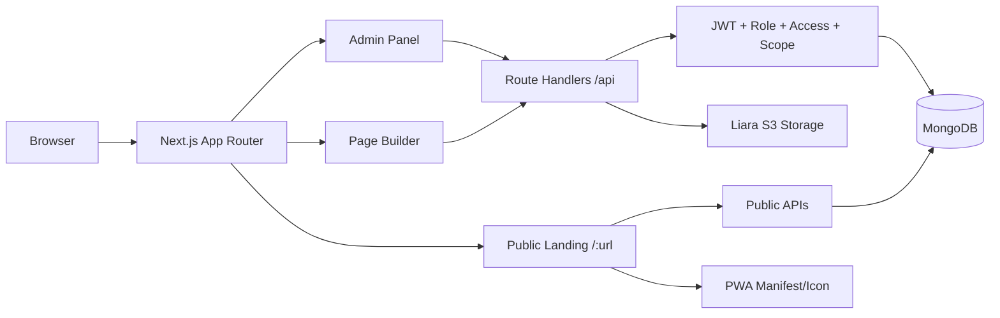
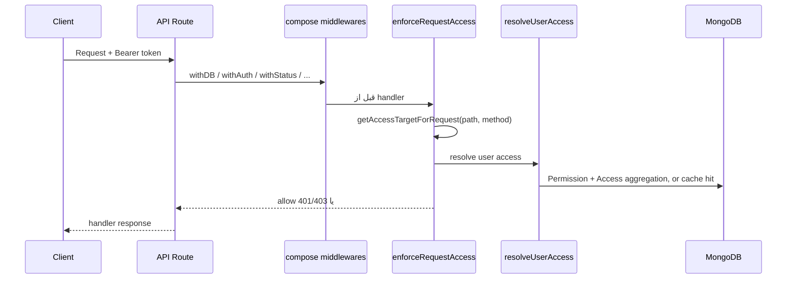

# Radlink System Blueprint

آخرین بازبینی کد: 2026-07-15

این فایل مرجع سریع و عملیاتی پروژه است. هدفش این است که هر نفر جدیدی با خواندن همین سند بفهمد Radlink چطور کار می‌کند، مسیرهای حساس کجاست، چه فایل‌هایی برای تغییر خطرناک‌ترند، و برای توسعه آینده باید از چه قراردادهایی پیروی کند.

این سند بر اساس داکیومنت‌های داخل `docs/` و بررسی مستقیم کد فعلی نوشته شده است. هر جا بین داکیومنت‌های قدیمی و کد اختلاف بوده، کد فعلی مبنا قرار گرفته است.

## خلاصه اجرایی

Radlink یک اپ monolith با Next.js App Router، React، TypeScript، MongoDB/Mongoose، Tailwind و styled-components است. محصول اصلی یک پنل مدیریت و صفحه‌ساز لندینگ است:

- کاربر/نماینده/ادمین/سوپرادمین وارد پنل می‌شود.
- با access و permission مشخص می‌شود چه بخش‌هایی را می‌بیند و چه عملیاتی می‌تواند انجام دهد.
- صفحه‌ساز با بلاک‌های قابل تنظیم، یک `Page` یا `Template` می‌سازد.
- صفحه عمومی از مسیر `/{url}` رندر می‌شود.
- هر صفحه می‌تواند لوگو، هدر، فوتر، فونت، بک‌گراند، favicon/PWA icon، QR، نوتیفیکیشن، رزرو و محصولات داشته باشد.

جریان اصلی پروژه این است:



## تکنولوژی‌ها

| بخش | تکنولوژی | فایل‌های کلیدی |
| --- | --- | --- |
| Runtime | Next.js 16 App Router | `app/`, `app/api/` |
| UI | React 19, Tailwind 4 | `components/`, `builder/`, `app/globals.css` |
| CSS-in-JS | styled-components | `lib/registry.tsx`, بلاک‌های builder |
| Database | MongoDB + Mongoose | `lib/data/db.ts`, `models/` |
| Auth | JWT، OTP، password login | `lib/auth/`, `app/api/auth/` |
| Storage | Liara S3-compatible | `lib/s3.ts`, `lib/liaraStorage.ts`, `app/api/uploads/` |
| PWA | manifest، service worker، dynamic icons | `public/site.webmanifest`, `public/sw.js`, `app/api/landing-*` |
| QR | `qrcode` + Liara upload | `lib/qrCode.ts` |
| Image processing | `sharp` | `app/api/landing-icon/[url]/[size]/route.tsx` |

## نقشه پوشه‌ها

| مسیر | مسئولیت |
| --- | --- |
| `app/` | مسیرهای App Router، صفحات اصلی، پنل، builder و public landing |
| `app/api/` | Route Handlerهای API |
| `app/[url]/` | رندر عمومی هر لندینگ ساخته‌شده |
| `builder/` | صفحه‌ساز، بلاک‌ها، فرم‌های محتوا/استایل، theme studio |
| `components/admin/` | تمام بخش‌های پنل ادمین |
| `components/global/` | کامپوننت‌های مشترک مثل `DynamicTable` |
| `components/landing/` | هدر/فوتر/PWA prompt/actionهای public landing |
| `components/pwa/` | ثبت service worker |
| `contexts/` | contextهای auth/theme/user |
| `hook/` | hookهای auth، admin route، table، builder |
| `lib/` | منطق shared سمت سرور و کلاینت: auth، design، storage، products، bookings |
| `models/` | مدل‌های Mongoose |
| `types/` | قراردادهای TypeScript مخصوص بلاک‌ها و جدول |
| `next-persian-fonts/` | فونت‌های قابل انتخاب برای لندینگ |
| `public/` | فایل‌های عمومی، favicon، manifest، service worker و assetها |
| `docs/` | مستندات پروژه |

## مسیرهای اصلی اپ

| Route | نقش |
| --- | --- |
| `/` | صفحه اصلی سایت Radlink |
| `/auth` | ورود با OTP یا password |
| `/admin` | پنل مدیریت، با hash route برای sectionها |
| `/builder` | ساخت صفحه یا قالب جدید |
| `/builder/[pageId]` | ویرایش صفحه موجود |
| `/[url]` | لندینگ عمومی ساخته‌شده |

نکته App Router: فایل‌های `page.tsx` و `layout.tsx` به صورت پیش‌فرض Server Component هستند. هر جا state، event، localStorage یا browser API داریم، فایل با `"use client"` شروع شده است. صفحه‌ساز عمدا با `dynamic(..., { ssr: false })` لود می‌شود چون کاملا تعاملی و browser-heavy است.

## مدل داده‌ها

### User

فایل: `models/users.ts`

کاربر می‌تواند یکی از نقش‌های زیر را داشته باشد:

- `user`
- `agent`
- `admin`
- `superAdmin`

فیلدهای مهم:

- `phoneNumber`: شناسه اصلی ورود، unique و 11 رقمی.
- `passwordHash`: برای ورود با رمز، با `select: false`.
- `role`, `status`: نقش و فعال/غیرفعال بودن.
- `permissions`: لیست Permissionهای متصل به کاربر.
- `limits`: سقف فایل، بلاک و صفحه.
- `agentid`: اتصال user به Agent.
- `isDeleted`: soft-delete منطقی برای کاربرها.

### Agent

فایل: `models/agent.ts`

نماینده به یک User وصل است و می‌تواند شخصی یا شرکتی باشد. Agent برای scope داده‌ها مهم است، چون نماینده فقط خودش و userهای زیرمجموعه‌اش را می‌بیند.

فیلدهای مهم:

- `user`: کاربر مالک Agent.
- `type`: `personal` یا `company`.
- `limits`: سقف منابع برای نماینده.
- `isActive`: فعال بودن نماینده.

### Access

فایل: `models/access.ts`

Access یک سند قابل استفاده مجدد برای تعریف دسترسی‌هاست. دو نوع دسترسی دارد:

- Static component access: مثل `admin.pages:view`.
- Dynamic resource access: مثل `pages:<pageId>:publish`.

اکشن‌های فعلی:

- `view`
- `create`
- `update`
- `delete`
- `publish`

وضعیت فعلی اکشن‌ها در کد:

- Dashboard فقط `view` دارد.
- Pages همه اکشن‌ها از جمله `publish` را دارد.
- Blocks اکشن `delete` ندارد ولی `publish` دارد.
- Templates اکشن `publish` ندارد و با اکشن‌های معمولی مدیریت می‌شود.
- بیشتر sectionهای دیگر `view/create/update/delete` دارند و `publish` ندارند.

### Permission

فایل: `models/permission.ts`

Permission چند Access را گروه می‌کند و به چند user وصل می‌کند.

فیلدهای مهم:

- `accesses`: لیست Accessهای داخل این permission.
- `assignedToUsers`: userهایی که permission را گرفته‌اند.
- `grantedBy`
- `isActive`

### Page

فایل: `models/pages.ts`

مهم‌ترین مدل سیستم است. لندینگ واقعی کاربر اینجاست.

فیلدهای مهم:

- `title`, `description`, `url`
- `owner`: صاحب اصلی صفحه.
- `assignedUser`: اگر صفحه توسط admin/agent برای user ساخته شده باشد، این user هم باید به صفحه و رزروهایش دسترسی داشته باشد.
- `template`: قالب مبدا، اختیاری.
- `blocks`: آرایه embedded از snapshot کامل بلاک‌ها.
- `background`: رنگ، تصویر و pattern صفحه.
- `font`: فونت انتخابی لندینگ.
- `logo`, `logoShape`
- `logoHeader`: تنظیمات هدر لوگودار.
- `footer`: تنظیمات فوتر.
- `favicon`
- `thumbnail`
- `seo`
- `settings`: تنظیمات آزاد مثل فعال/غیرفعال بودن آیکن اختصاصی home screen.
- `stats.views`, `stats.visitors`
- `isPublished`
- `expiresAt`, `publishedAt`

اصل مهم: `Page.blocks` فقط reference نیست؛ snapshot کامل هر بلاک است. بعد از اضافه شدن بلاک به صفحه، تغییرات کاربر در همان snapshot ذخیره می‌شود.

### Block

فایل: `models/blocks.ts`

Block مدل master برای کاتالوگ بلاک‌هاست. صفحه‌ساز می‌تواند هم از registry کدی و هم از master blockهای دیتابیس استفاده کند.

فیلدهای مهم:

- `name`, `type`, `description`, `icon`, `category`
- `version`
- `data`, `settings`
- `elements`
- `contentFields`
- `defaultBlock`
- `isActive`
- `stats.usageCount`

### Template

فایل: `models/template.ts`

قالب برای شروع سریع صفحه‌سازی استفاده می‌شود.

فیلدهای مهم:

- `name`, `description`, `thumbnail`
- `style`
- `background`
- `logoHeader`
- `footer`
- `category`
- `blocks`: legacy refs به Blockها.
- `builderBlocks`: snapshotهای جدید صفحه‌ساز.
- `isActive`

### Booking

فایل: `models/booking.ts`

رزروهای فرم booking در دیتابیس پروژه ذخیره می‌شوند و با page/owner/assignedUser/agent scope جدا می‌شوند.

فیلدهای مهم:

- `page`
- `pageOwner`
- `assignedUser`
- `agent`
- `blockInstanceId`
- `fullName`, `phone`, `email`
- `selectedDate`, `selectedTime`
- `note`
- `customFields`
- `status`: `new`, `confirmed`, `cancelled`, `done`
- `sourceUrl`, `userAgent`, `ip`, `payload`

### Product

فایل: `models/products.ts`

محصولات هم دستی ساخته می‌شوند و هم از بلاک `productCards` سینک می‌شوند.

فیلدهای مهم:

- `owner`
- `page`
- `source`: `manual` یا `builder`
- `sourceBlockInstanceId`
- `sourceItemId`
- `displayPrice`, `price`, `oldPrice`
- `image`, `imageFile`

برای محصولات builder یک unique index روی `page + sourceBlockInstanceId + sourceItemId` وجود دارد.

### File

فایل: `models/files.ts`

هر upload، QR، فایل ticket یا asset هدر لوگو اینجا رکورد می‌شود.

فیلدهای مهم:

- `filename`
- `path`
- `owner`
- `mimeType`, `size`
- `kind`: `upload`, `qr`, `ticket`, `logo-header`
- `page`

### QR

فایل: `models/qr.ts`

برای هر صفحه QR ساخته می‌شود.

فیلدهای مهم:

- `page`
- `owner`
- `file`
- `targetUrl`
- `imageurl`
- `shortcode`
- `isActive`

### Notification

فایل: `models/notification.ts`

اعلان می‌تواند برای یک صفحه یا global باشد. در public landing نمایش داده می‌شود.

فیلدهای مهم:

- `page`
- `createdBy`
- `createdByName`
- `title`, `subtitle`, `description`
- `type`: `info` یا `danger`
- `iconKey`
- `closeable`
- `isGlobal`
- `isActive`

### Ticket

فایل: `models/tickets.ts`

سیستم پشتیبانی با requester/assignee/replies/attachments.

نکته مهم: replies داخل خود Ticket embedded هستند. برای ticketهای خیلی طولانی ممکن است در آینده نیاز به collection جدا داشته باشد.

## Authentication

فایل‌های اصلی:

- `app/api/auth/send-otp/route.ts`
- `app/api/auth/verify-otp/route.ts`
- `app/api/auth/login-password/route.ts`
- `app/api/auth/password/route.ts`
- `app/api/auth/me/route.ts`
- `lib/auth/jwt.ts`
- `lib/auth/password.ts`
- `lib/auth/otp-store.ts`
- `contexts/AdminAuthContext.tsx`

جریان ورود:

1. کاربر شماره موبایل می‌دهد.
2. `/api/auth/send-otp` کاربر را در صورت نبودن می‌سازد، OTP را در `otpStore` می‌گذارد و SMS می‌فرستد.
3. `/api/auth/verify-otp` باید OTP را بررسی کند و JWT بدهد.
4. توکن در `localStorage` با کلید `auth_token` ذخیره می‌شود.
5. پنل ادمین با `AdminAuthProvider` وجود توکن را چک می‌کند.
6. APIهای محافظت‌شده با `withAuth()` توکن را می‌خوانند و user را در `req.ctx.user` می‌گذارند.

ریسک فعلی بسیار مهم:

در کد فعلی، بررسی واقعی OTP در `app/api/auth/verify-otp/route.ts` کامنت شده است. یعنی اگر phone موجود باشد، مسیر verify می‌تواند بدون مقایسه OTP واقعی کاربر را verified کند و JWT بدهد. این مورد در `docs/BUGS.md` هم به عنوان P0 آمده و هنوز در کد فعلی دیده می‌شود.

## Authorization و Scope

فایل‌های اصلی:

- `lib/auth/accessCatalog.ts`
- `lib/auth/accessRules.ts`
- `lib/auth/enforceAccess.ts`
- `lib/auth/compose.ts`
- `lib/auth/middlewares.ts`
- `lib/auth/resolveUserAccess.ts`
- `lib/auth/accessCache.ts`
- `lib/auth/agentScope.ts`
- `lib/auth/resourceScope.ts`
- `lib/auth/builderBlockAccess.ts`
- `lib/auth/pagePublishAccess.ts`
- `hook/auth/useAccess.ts`

جریان server-side:



نکته مهم: `compose()` فقط middlewareها را اجرا نمی‌کند. بعد از middlewareها و قبل از route handler، `enforceRequestAccess()` را هم اجرا می‌کند. بنابراین هر route که با `compose()` ساخته شده باشد، تحت mapping مرکزی `accessRules` قرار می‌گیرد.

قوانین مهم:

- `superAdmin` همه دسترسی‌ها را bypass می‌کند.
- `admin` و `superAdmin` در owner scope معمولا global هستند.
- `agent` فقط خودش و userهای زیرمجموعه‌اش را می‌بیند.
- `user` فقط منابع خودش و صفحه‌هایی که به خودش assign شده‌اند را می‌بیند.
- برای صفحه‌ها، `withPageAccessScope` هم `owner` و هم `assignedUser` را لحاظ می‌کند.
- برای رزروها، `withBookingAccessScope` علاوه بر `pageOwner` و `assignedUser`، خود Pageهای assign شده و agent را هم لحاظ می‌کند.

Frontend:

- `useAccess()` از `/api/auth/me` با SWR access map را می‌گیرد.
- `can(component, action)` برای static component است.
- `canOnResource(resource, id, action)` برای pages/templates/blocks است.
- `DynamicTable` با `getAccessTargetForRequest(endpoint, method)` اکشن‌های table را کنترل می‌کند.
- `AdminShell` sectionها را با access `view` فیلتر می‌کند.

## Admin Panel

فایل‌های اصلی:

- `app/admin/page.tsx`
- `components/admin/AdminShell.tsx`
- `hook/admin/useHashRoute.ts`
- `components/global/DynamicTable.tsx`
- `hook/table/useTableData.ts`

مسیر `/admin` یک shell واحد دارد و sectionها با hash route کنترل می‌شوند. مثلا:

- `/admin`
- `/admin#pages`
- `/admin#bookings`

Sectionهای اصلی:

| Section | Component | Model/API |
| --- | --- | --- |
| dashboard | `DashboardSection` | `/api/admin/dashboard` |
| users | `UsersSection` | `User`, `/api/users` |
| agents | `AgentsSection` | `Agent`, `/api/agents` |
| permissions | `PermissionsSection` | `Permission`, `/api/permissions` |
| accesses | `AccessesSection` | `Access`, `/api/accesses` |
| pages | `PagesSection` | `Page`, `/api/pages` |
| templates | `TemplatesSection` | `Template`, `/api/templates` |
| blocks | `BlocksSection` | `Block`, `/api/blocks` |
| categories | `CategoriesSection` | `Category`, `/api/categories` |
| files | `FilesSection` | `File`, `/api/files` |
| qrcodes | `QRCodesSection` | `QR`, `/api/qr` |
| products | `ProductsSection` | `Product`, `/api/products` |
| tickets | `TicketsSection` | `Ticket`, `/api/tickets` |
| bookings | `BookingsSection` | `Booking`, `/api/bookings` |
| notifications | `NotificationsSection` | `Notification`, `/api/notifications` |
| contactMessages | `ContactMessagesSection` | `ContactMessage`, `/api/contact` |
| profile | `ProfileSection` | `/api/auth/me`, `/api/auth/password` |

`DynamicTable` بسیار مهم است. امکاناتش:

- fetch server-side با pagination/search/filter/sort.
- export به CSV/Excel/PNG.
- cell copy.
- inline/update modal.
- row actions.
- action buttons.
- access-aware create/update/delete.

ریسک نگهداری: `DynamicTable.tsx` بسیار بزرگ است و هر تغییر در آن می‌تواند روی چندین section اثر بگذارد.

## Page Builder

ورودی‌ها:

- `app/builder/page.tsx`: ساخت صفحه یا قالب جدید.
- `app/builder/[pageId]/page.tsx`: ویرایش صفحه موجود.
- `builder/editor/PageBuilder.tsx`: موتور اصلی صفحه‌ساز.

جریان ساخت صفحه جدید:

1. `/builder` اجرا می‌شود.
2. `authorizeBuilderAccess()` دسترسی را چک می‌کند.
3. اگر page mode و template انتخاب نشده باشد، `SmartSuggestions` نمایش داده می‌شود.
4. کاربر قالب انتخاب می‌کند یا blank شروع می‌کند.
5. `SimplePageBuilder` با initial blocks/meta/background/header/footer بالا می‌آید.
6. کاربر بلاک‌ها را اضافه، حذف، مرتب، مخفی، duplicate و style می‌کند.
7. تغییرات draft در localStorage نگه‌داری می‌شود.
8. save نهایی به `/api/pages` یا `/api/templates` می‌رود.

stateهای مهم PageBuilder:

- `blocks`
- `selectedBlockId`
- `selectedElementId`
- `pageTitle`, `pageDescription`, `pageUrl`
- `pageLogo`, `pageLogoShape`, `pageFavicon`
- `pageFont`
- `pageBackgroundColor`, `pageBackgroundImage`, `pageBackgroundPattern`
- `logoHeader`
- `pageFooter`
- `themeDraft`
- undo/redo history
- server save state

ذخیره صفحه:

- اگر صفحه جدید باشد: `POST /api/pages`
- اگر صفحه موجود باشد: `PATCH /api/pages/[id]`
- اگر قالب جدید باشد: `POST /api/templates`
- اگر قالب موجود باشد: `PATCH /api/templates/[id]`

در ذخیره صفحه این اتفاق‌ها می‌افتد:

- slug با `lib/validation/pageSlug.ts` sanitize/validate می‌شود.
- owner و assignedUser بررسی می‌شوند.
- اگر publish درخواست شده باشد، `assertPagePublishAccess` اجرا می‌شود.
- دسترسی ساخت/ویرایش/publish بلاک‌ها با `assertBuilderBlockMutationAccess` چک می‌شود.
- quota صفحات/بلاک‌ها بررسی می‌شود.
- products از بلاک `productCards` با `syncPageProducts` سینک می‌شوند.
- QR برای صفحه جدید ساخته می‌شود.
- صفحه با blocks embedded ذخیره می‌شود.

## Block System

فایل اصلی: `builder/blocks/blockRegistry.ts`

هر بلاک سه فایل اصلی دارد:

- `*.default.ts`: ساخت default block.
- `*.schema.ts`: تعریف contentFields و elements قابل ویرایش.
- `*Block.tsx`: رندر UI بلاک.

بلاک‌های فعلی:

- `banner`
- `slider`
- `simpleLink`
- `superLink`
- `video`
- `richText`
- `testimonial`
- `faq`
- `contactInfo`
- `contactSave`
- `mapLinks`
- `cta`
- `countdown`
- `separator`
- `messengerLinks`
- `storyHighlights`
- `productCards`
- `bookingForm`

قرارداد مهم بلاک:

```ts
type PageBlock = {
  instanceId: string;
  type: string;
  version: number;
  order: number;
  isActive: boolean;
  hidden?: boolean;
  data: Record<string, unknown>;
  settings: Record<string, unknown>;
  elements: Record<string, BlockElement>;
};
```

`data` محتوای واقعی بلاک است: متن، لینک، عکس، آیتم‌ها و غیره.

`elements` ظاهر قابل ویرایش را نگه می‌دارد: رنگ، فونت، بک‌گراند، border، shadow، animation، align، margin/padding.

registry الان به صورت مرکزی این قابلیت‌ها را به schema/default اضافه می‌کند:

- shadow برای بیشتر elementها.
- margin/padding برای `container`.
- content align برای `container`.
- text align برای elementهای متنی.

این یعنی برای توسعه بلاک جدید نباید همان قابلیت‌ها را دستی و پراکنده تکرار کرد؛ باید اجازه داد registry قرارداد مشترک را تزریق کند.

فایل‌های shared بسیار مهم:

- `builder/blocks/shared/EditablePart.tsx`
- `builder/blocks/shared/InlineEditableText.tsx`
- `builder/blocks/shared/responsiveStyleToCss.ts`

`responsiveStyleToCss.ts` تبدیل styleهای responsive به CSS واقعی را انجام می‌دهد و animation/shadow/textAlign/contentAlign را رندر می‌کند. اگر یک style در فرم انتخاب می‌شود ولی در خروجی اثر ندارد، اول این فایل و سپس component همان بلاک را بررسی کن.

## Dynamic Island و فرم‌های ویرایش

فایل‌های اصلی:

- `builder/editor/DynamicIslandPanel.tsx`
- `builder/editor/form/DynamicContentForm.tsx`
- `builder/editor/form/DynamicStyleForm.tsx`
- `builder/editor/form/RgbaColorInput.tsx`
- `builder/editor/form/RepeaterField.tsx`

منطق:

- کاربر روی بلاک یا element کلیک می‌کند.
- `selectedBlockId` و `selectedElementId` در PageBuilder ست می‌شود.
- Dynamic Island باز می‌شود.
- تب محتوا از `schema.contentFields` فرم می‌سازد.
- تب استایل از `schema.elements[selectedElementId].allowedStyleKeys` کنترل‌ها را می‌سازد.
- تغییرات محتوا به `block.data` می‌رود.
- تغییرات استایل به `block.elements[elementId].style` می‌رود.

قابلیت‌های مهم:

- repeater برای آیتم‌های تکرارشونده مثل پیام‌رسان، راه تماس، نقشه، محصول و custom fields رزرو.
- color picker portal-like برای جلوگیری از بریده شدن داخل modal.
- style responsive با mobile/tablet/desktop.
- shadow، animation، text align، content align، margin و padding.

## Theme و Design System لندینگ

فایل‌های مهم:

- `lib/builder/pageThemes.ts`
- `builder/editor/PageThemeStudio.tsx`
- `lib/design/page-background.ts`
- `lib/design/logo-header.ts`
- `lib/design/page-footer.ts`
- `lib/design/landing-fonts.ts`
- `lib/design/landing-fonts.next.ts`
- `lib/design/theme-tokens.ts`
- `lib/design/block-spacing.ts`
- `lib/builder/autoPolish.ts`

Theme Studio روی صفحه و بلاک‌ها اعمال می‌کند:

- رنگ‌های اصلی، ثانویه و accent.
- رنگ متن و سطح‌ها.
- shadowها.
- animationهای سبک.
- background pattern.
- logo header variant.
- footer colors.
- spacing/padding/margin برای زیبایی، نه صرفا مقداردهی مکانیکی.
- فونت landing.

نکته فعلی: تم نباید align محتوای بلاک‌ها را تغییر دهد. align باید تصمیم کاربر در style tab باشد، نه خروجی theme.

فونت‌های لندینگ از `next-persian-fonts/` با `next/font/local` در `landing-fonts.next.ts` تعریف شده‌اند و در public landing و builder preview اعمال می‌شوند.

## Public Landing Render

فایل‌های اصلی:

- `app/[url]/page.tsx`
- `app/[url]/layout.tsx`
- `app/[url]/PageRenderer.tsx`
- `components/landing/LogoHeaderFrame.tsx`
- `components/landing/LandingFooter.tsx`
- `components/landing/LandingFloatingActions.tsx`
- `components/landing/LandingIconHeadSync.tsx`
- `components/landing/LandingInstallPrompt.tsx`

جریان رندر:

1. `getPublicPage(url)` صفحه را از DB می‌خواند.
2. اگر صفحه نیست، `notFound`.
3. اگر `isPublished !== true` یا expired باشد، public content نمایش داده نمی‌شود.
4. اگر صفحه expired باشد و هنوز published مانده باشد، request عمومی آن را به unpublished تبدیل می‌کند.
5. metadata، favicon، manifest، Open Graph و appleWebApp ساخته می‌شود.
6. بک‌گراند و فونت صفحه normalize می‌شود.
7. `LogoHeaderFrame` رندر می‌شود.
8. `PageRenderer` بلاک‌ها را از registry پیدا می‌کند و component مربوطه را رندر می‌کند.
9. `contactSave` داخل flow اصلی رندر نمی‌شود و برای floating action استفاده می‌شود.
10. `LandingFooter` رندر می‌شود.
11. اگر owner صفحه access `landing.floatingActions:view` داشته باشد، floating actions نمایش داده می‌شود.
12. view counter با `/api/pages/[id]/view` increment می‌شود.

`PageRenderer` روی هر بلاک `getBlockSpacingStyle(b)` اعمال می‌کند. بنابراین margin/padding بیرونی بلاک‌ها در public landing هم اثر می‌گذارد.

## Header و Footer

Header:

- فایل render: `components/landing/LogoHeaderFrame.tsx`
- تنظیمات: `lib/design/logo-header.ts`
- ذخیره در Page/Template: `logoHeader`

Header می‌تواند:

- لوگو را وسط نمایش دهد.
- title و description زیر لوگو داشته باشد.
- background/gradient/pattern/wave داشته باشد.
- variantهای wave، glass، liquid و patternهای مختلف داشته باشد.

Footer:

- فایل render: `components/landing/LandingFooter.tsx`
- تنظیمات: `lib/design/page-footer.ts`
- ذخیره در Page/Template: `footer`

Footer باید همیشه با page logo کار کند، چون پروژه لوگوی جدا برای footer ندارد. متن Radlink branding هم از footer setting می‌آید و کلمه Radlink لینک‌دار/underline/bold رندر می‌شود.

نکته مهم UX:

- Header و Footer حتی صفحه خالی هم باید قابل مشاهده و قابل ادیت باشند.
- در ساخت صفحه از Template نباید دو Header یا دو Footer ساخته شود؛ فقط تنظیمات همان Header/Footer نهایی قابل ادیت است.
- کلیک روی Header باید editor مربوط به Header را باز کند.
- کلیک روی Footer باید editor مربوط به Footer را باز کند.

## PWA، favicon و Add to Home Screen

فایل‌های اصلی:

- `app/layout.tsx`
- `public/site.webmanifest`
- `public/sw.js`
- `components/pwa/PwaServiceWorker.tsx`
- `app/api/landing-manifest/[url]/route.ts`
- `app/api/landing-icon/[url]/[size]/route.tsx`
- `lib/design/landing-icons.ts`
- `components/landing/LandingIconHeadSync.tsx`
- `components/landing/LandingInstallPrompt.tsx`

دو سطح PWA داریم:

1. خود سایت Radlink:
   - manifest ثابت: `/site.webmanifest`
   - iconهای ثابت public.
   - service worker با scope `/`.

2. هر landing:
   - manifest داینامیک: `/api/landing-manifest/[url]`
   - icon داینامیک PNG: `/api/landing-icon/[url]/[size]`
   - اگر custom home screen icon فعال باشد و favicon/page logo معتبر باشد، icon اختصاصی ساخته می‌شود.
   - اگر custom icon غیرفعال باشد، icon رادلینک fallback می‌شود.

کلید setting:

- `customHomeScreenIconEnabled`

منطق icon:

- browser favicon از `favicon` یا fallback رادلینک می‌آید.
- install/home screen icon از API داینامیک ساخته می‌شود تا سایز 180/192/512 مناسب داشته باشد.
- `sharp` تصویر منبع را روی canvas سفید normalize می‌کند.
- نسخه icon از `updatedAt` صفحه به query اضافه می‌شود تا cache قدیمی کمتر مشکل بسازد.

Install prompt:

- روی مرورگرهای پشتیبانی‌کننده از `beforeinstallprompt` دکمه نصب سریع نشان می‌دهد.
- روی iOS راهنمای Add to Home Screen نشان می‌دهد.
- prompt بعد از dismiss به مدت 7 روز در localStorage مخفی می‌ماند.
- وقتی prompt باز است، صفحه پشت آن کمی blur می‌شود.

## Upload و File lifecycle

فایل‌های مهم:

- `app/api/uploads/route.ts`
- `app/api/uploads/delete/route.ts`
- `app/api/files/route.ts`
- `app/api/files/[id]/route.ts`
- `lib/s3.ts`
- `lib/liaraStorage.ts`
- `lib/fileDeletion.ts`
- `lib/fileUtils.ts`

جریان upload:

1. API auth و active status را چک می‌کند.
2. quota فایل با `checkUserQuota` بررسی می‌شود.
3. نوع فایل و size چک می‌شود.
4. فایل با `arrayBuffer()` در حافظه خوانده می‌شود.
5. نام فایل sanitize می‌شود.
6. object در Liara upload می‌شود.
7. سند `File` ساخته می‌شود.
8. اگر ساخت سند DB شکست بخورد، object از storage حذف می‌شود.

ریسک فعلی:

- upload حافظه‌محور است و فایل ویدئویی تا 50MB را در RAM می‌خواند.
- MIME به header فایل وابسته است.
- برای scale بالا بهتر است presigned/direct upload اضافه شود.

Deletion:

- `deleteFileByIdentifier` اول ownership/scope را چک می‌کند.
- بعد object storage را حذف می‌کند.
- سپس DB record حذف می‌شود.
- اگر storage key تشخیص داده نشود، حذف DB انجام نمی‌شود تا orphan ساخته نشود.

## QR lifecycle

فایل‌های مهم:

- `lib/qrCode.ts`
- `app/api/qr/route.ts`
- `app/api/qr/[id]/route.ts`
- `models/qr.ts`

وقتی صفحه ساخته می‌شود، `createQrForPage`:

1. اگر QR صفحه وجود دارد، همان را برمی‌گرداند.
2. target URL را با `NEXT_PUBLIC_APP_URL` یا `APP_URL` یا origin request می‌سازد.
3. QR PNG تولید می‌کند.
4. PNG را در Liara upload می‌کند.
5. File record با kind `qr` می‌سازد.
6. QR record می‌سازد.

ریسک فعلی:

- check-then-create بدون unique index روی `page` می‌تواند در race QR duplicate بسازد.

## Products lifecycle

فایل‌های مهم:

- `builder/blocks/product-cards/`
- `lib/products/syncPageProducts.ts`
- `models/products.ts`
- `components/admin/ProductsSection.tsx`
- `app/api/products/`

محصولات از دو مسیر می‌آیند:

- دستی در پنل Products.
- خودکار از بلاک `productCards`.

وقتی صفحه ذخیره می‌شود، `syncPageProducts` محصولات داخل بلاک‌های productCards را می‌خواند، price را numeric می‌کند، فایل عکس را match می‌کند و Productهای builder را upsert/delete می‌کند.

## Bookings lifecycle

فایل‌های مهم:

- `builder/blocks/booking-form/`
- `app/api/bookings/route.ts`
- `app/api/bookings/[id]/route.ts`
- `lib/bookings/bookingAccess.ts`
- `models/booking.ts`
- `components/admin/BookingsSection.tsx`

ثبت رزرو public است و auth نمی‌خواهد:

1. بلاک booking form اطلاعات را به `/api/bookings` POST می‌کند.
2. API صفحه را با `pageId` یا `pageUrl` پیدا می‌کند.
3. اگر صفحه published نباشد، رزرو ثبت نمی‌شود.
4. owner، assignedUser و agent صفحه روی booking ذخیره می‌شود.
5. custom fields هم به صورت key/label/value ذخیره می‌شود.

خواندن رزروها:

- نیاز به `admin.bookings:view` دارد.
- superAdmin/admin همه را می‌بینند.
- agent رزروهای خودش و userهای زیرمجموعه‌اش را می‌بیند.
- user رزروهای pageهایی را می‌بیند که owner یا assignedUser آن‌هاست.

نکته مهم: اگر admin یا superAdmin صفحه‌ای را برای user ساخته و `assignedUser` زده، رزروهای آن صفحه باید برای همان user هم نمایش داده شود.

## Notifications

فایل‌های مهم:

- `models/notification.ts`
- `app/api/notifications/route.ts`
- `components/admin/NotificationsSection.tsx`
- `app/[url]/PageNotificationModal.tsx`

notification می‌تواند:

- مخصوص یک page باشد.
- global باشد.

در public landing، اعلان‌های فعال page و global خوانده می‌شوند. `createdByName` به عنوان snapshot نام سازنده ذخیره می‌شود تا حتی اگر user بعدا تغییر کند، نام قابل نمایش باشد.

## Tickets

فایل‌های مهم:

- `models/tickets.ts`
- `app/api/tickets/`
- `components/admin/TicketsSection.tsx`

Ticket شامل requester، assignee، category، attachments و replies embedded است. برای scale بالا، replies می‌تواند در آینده به collection مستقل منتقل شود.

## API Route map

| مسیر | مسئولیت |
| --- | --- |
| `/api/auth/send-otp` | ارسال OTP و ساخت user در صورت نیاز |
| `/api/auth/verify-otp` | تایید OTP و صدور JWT |
| `/api/auth/login-password` | ورود با رمز |
| `/api/auth/password` | تنظیم/تغییر رمز |
| `/api/auth/me` | user فعلی + access map |
| `/api/admin/dashboard` | آمار dashboard |
| `/api/users` و `/api/users/[id]` | مدیریت کاربران |
| `/api/users/[id]/role` | تغییر role |
| `/api/users/[id]/status` | تغییر status |
| `/api/agents` و `/api/agents/[id]` | مدیریت نمایندگان |
| `/api/permissions` و `/api/permissions/[id]` | مدیریت Permission |
| `/api/accesses` و `/api/accesses/[id]` | مدیریت Access |
| `/api/blocks` و `/api/blocks/[id]` | کاتالوگ master blocks |
| `/api/blocks/sync` | sync کردن registry blocks به DB |
| `/api/templates` و `/api/templates/[id]` | قالب‌ها |
| `/api/builder/template-catalog` | کاتالوگ قالب برای builder |
| `/api/pages` و `/api/pages/[id]` | صفحات |
| `/api/pages/[id]/blocks` | mutationهای legacy/جزئی روی blocks |
| `/api/pages/[id]/view` | آمار بازدید public |
| `/api/categories` و `/api/categories/[id]` | دسته‌بندی قالب‌ها |
| `/api/uploads` | upload فایل |
| `/api/uploads/delete` | حذف فایل |
| `/api/files` و `/api/files/[id]` | فایل‌ها |
| `/api/qr` و `/api/qr/[id]` | QR |
| `/api/products` و `/api/products/[id]` | محصولات |
| `/api/bookings` و `/api/bookings/[id]` | رزروها |
| `/api/notifications` و `/api/notifications/[id]` | اعلان‌ها |
| `/api/tickets` و `/api/tickets/[id]` | تیکت‌ها |
| `/api/tickets/[id]/assign` | assign تیکت |
| `/api/contact` و `/api/contact/[id]` | پیام‌های تماس |
| `/api/landing-manifest/[url]` | manifest داینامیک هر لندینگ |
| `/api/landing-icon/[url]/[size]` | آیکن PNG داینامیک برای PWA |

## فایل‌های بسیار حساس

این فایل‌ها هم امنیتی‌اند هم behavioral. تغییرشان باید با دقت، تست و review انجام شود.

| فایل | چرا حساس است |
| --- | --- |
| `.env`, `.env.local` | secretها، DB، JWT، SMS، Liara |
| `lib/data/db.ts` | اتصال DB کل پروژه |
| `lib/auth/jwt.ts` | امضای JWT |
| `lib/auth/middlewares.ts` | auth، role، status، permission |
| `lib/auth/compose.ts` | enforcement عمومی APIها |
| `lib/auth/accessRules.ts` | mapping مسیر API به access |
| `lib/auth/enforceAccess.ts` | تصمیم نهایی allow/deny |
| `lib/auth/resolveUserAccess.ts` | aggregation اصلی Permission/Access |
| `lib/auth/accessCache.ts` | cache دسترسی‌ها |
| `lib/auth/agentScope.ts` | محدوده agent/user/admin |
| `lib/auth/resourceScope.ts` | scope page/template |
| `lib/auth/builderBlockAccess.ts` | اجازه استفاده/ذخیره/publish بلاک در builder |
| `lib/auth/pagePublishAccess.ts` | اجازه publish صفحات |
| `app/api/auth/verify-otp/route.ts` | نقطه صدور JWT و ریسک فعلی OTP bypass |
| `app/api/auth/send-otp/route.ts` | OTP، rate limit اولیه، ساخت user |
| `app/api/pages/route.ts` | ساخت/list صفحه، QR، sync products، publish |
| `app/api/pages/[id]/route.ts` | ویرایش/حذف صفحه، blocks، publish، owner |
| `app/api/uploads/route.ts` | upload public فایل، quota، storage |
| `lib/s3.ts`, `lib/liaraStorage.ts` | credential و object storage |
| `lib/fileDeletion.ts` | حذف storage و DB record |
| `models/users.ts` | identity و role |
| `models/access.ts` | قرارداد permission |
| `models/permission.ts` | assignment دسترسی‌ها |
| `models/pages.ts` | کل لندینگ‌ها و public state |
| `models/booking.ts` | اطلاعات مشتری و رزرو |
| `models/files.ts` | فایل‌های آپلودی و لینک‌ها |

## فایل‌های high-impact ولی کمتر امنیتی

این فایل‌ها اگر خراب شوند خروجی محصول، UX یا داده‌ها آسیب می‌بیند.

| فایل | اثر |
| --- | --- |
| `builder/editor/PageBuilder.tsx` | قلب صفحه‌ساز |
| `builder/blocks/blockRegistry.ts` | تعریف تمام بلاک‌های قابل استفاده |
| `types/blocks/builder.types.ts` | قرارداد block/schema/style |
| `builder/editor/DynamicIslandPanel.tsx` | تجربه ویرایش محتوا/استایل |
| `builder/editor/form/DynamicContentForm.tsx` | فرم محتوا برای همه بلاک‌ها |
| `builder/editor/form/DynamicStyleForm.tsx` | فرم استایل برای همه بلاک‌ها |
| `builder/blocks/shared/responsiveStyleToCss.ts` | تبدیل style به CSS واقعی |
| `builder/BuilderCanvas.tsx` | canvas و preview داخل builder |
| `builder/BuilderModals.tsx` | modalهای ذخیره صفحه/قالب |
| `builder/editor/PageThemeStudio.tsx` | اعمال theme و preview |
| `lib/builder/pageThemes.ts` | presetهای theme |
| `lib/design/page-background.ts` | pattern/background صفحه |
| `lib/design/logo-header.ts` | تنظیمات هدر |
| `lib/design/page-footer.ts` | تنظیمات فوتر |
| `lib/design/landing-fonts.ts` | فونت‌های لندینگ |
| `components/global/DynamicTable.tsx` | جدول همه sectionهای ادمین |
| `components/admin/AdminShell.tsx` | ناوبری پنل |
| `components/admin/PagesSection.tsx` | مدیریت صفحات و publish |
| `components/admin/BookingsSection.tsx` | مدیریت رزروها |
| `app/[url]/page.tsx` | public landing |
| `app/[url]/PageRenderer.tsx` | رندر بلاک‌ها در public |
| `components/landing/LandingFooter.tsx` | فوتر public |
| `components/landing/LogoHeaderFrame.tsx` | هدر public |
| `components/landing/LandingInstallPrompt.tsx` | نصب PWA |

## فایل‌های کم‌ریسک‌تر

کم‌ریسک‌تر به معنی بی‌اهمیت نیست؛ یعنی معمولا secret یا ownership مستقیم ندارند.

| مسیر | توضیح |
| --- | --- |
| `docs/` | مستندات |
| `public/assets/` | assetهای عمومی |
| `public/favicon*`, `public/apple-touch-icon.png` | iconهای fallback رادلینک |
| `next-persian-fonts/` | فونت‌ها |
| `lib/design/tokens.ts` | tokenهای UI عمومی |
| `lib/design/helpers.ts` | helperهای visual |
| `components/static/` | صفحات static مثل auth UI |

## Environment Variables

متغیرهای مهم:

| نام | کاربرد |
| --- | --- |
| `MONGODB_URI` | اتصال MongoDB |
| `MONGODB_DNS_SERVERS` | DNS سفارشی برای `mongodb+srv` |
| `JWT_SECRET` | امضای JWT |
| `SMS_IR_API_KEY` یا `smskey` | SMS.ir |
| `SMS_IR_LINE_NUMBER` | خط ارسال SMS |
| `SMS_IR_TEMPLATE_ID` | template ارسال OTP |
| `SERVICE_SMS`, `TICKET_SMS_TEMPLATE` | templateهای SMS دیگر |
| `LIARA_ENDPOINT` | endpoint object storage |
| `LIARA_BUCKET_NAME` | bucket |
| `LIARA_ACCESS_KEY` | access key |
| `LIARA_SECRET_KEY` | secret key |
| `LIARA_PUBLIC_URL` | public base اختیاری |
| `NEXT_PUBLIC_LIARA_PUBLIC_URL` | public storage URL سمت client |
| `NEXT_PUBLIC_STORAGE_URL` | fallback storage URL |
| `NEXT_PUBLIC_APP_URL` | base URL برای QR و لینک‌ها |
| `APP_URL` | fallback server base URL |

این‌ها هرگز نباید داخل client bundle، log عمومی، screenshot یا docs عمومی با مقدار واقعی بیایند.

## قواعد توسعه بلاک جدید

برای اضافه کردن بلاک جدید:

1. پوشه جدید در `builder/blocks/<block-name>/` بساز.
2. `*.default.ts` بساز و یک `PageBlock` کامل با `instanceId` پایدار تولید کن.
3. `*.schema.ts` بساز و contentFields و elements را تعریف کن.
4. `*Block.tsx` را طوری بنویس که `mode`, `selectedElementId`, `onSelectElement`, `onUpdateContent` را رعایت کند.
5. برای هر بخش قابل انتخاب از `EditablePart` استفاده کن.
6. برای textهای inline از `InlineEditableText` استفاده کن.
7. style را از `responsiveStyleToCss` بگیر.
8. بلاک را در `blockRegistry.ts` register کن.
9. اگر داده repeatable دارد، schema را با `repeater` طراحی کن.
10. اگر داده بلاک باید وارد collection جدا شود، sync آن را در save page اضافه کن.
11. برای public render مطمئن شو mode `public` بدون editor affordance کار می‌کند.

نباید:

- styleهای قابل ویرایش را فقط در component hardcode کنی.
- type بلاک با registry/schema/default متفاوت باشد.
- element keyها بدون دلیل عوض شوند؛ چون داده صفحات قبلی را می‌شکنند.
- `instanceId` را در render با random بسازی.

## قواعد توسعه API جدید

برای API محافظت‌شده:

1. Route را با `compose(withDB(), withAuth(), withStatus("active"), ...)` بساز.
2. مسیر را در `lib/auth/accessRules.ts` map کن.
3. اگر section جدید است، key را در `lib/auth/accessCatalog.ts` اضافه کن.
4. اگر admin section دارد، در `hook/admin/useHashRoute.ts` و `AdminShell`/`app/admin/page.tsx` وارد کن.
5. اگر table دارد، از `DynamicTable` استفاده کن.
6. اگر owner-scoped است، از `withActorOwnerScope`, `canAccessActorOwner`, `withPageAccessScope` یا scope مناسب استفاده کن.
7. اگر تغییر permission/access می‌دهد، cache را invalidate کن.

## قواعد مهم داده

- Page list نباید blocks را برگرداند؛ در `GET /api/pages` الان `.select("-blocks")` استفاده شده تا جدول صفحات سبک‌تر باشد.
- Single page GET باید blocks را برگرداند چون builder edit به آن نیاز دارد.
- Page blocks snapshot هستند؛ تغییر master Block نباید خودکار صفحه‌های قبلی را بشکند.
- `assignedUser` برای page و booking مهم است و نباید نادیده گرفته شود.
- publish یک اکشن حساس است و فقط برای pages و blocks معنی دارد.
- dashboard فقط view است؛ create/update/delete/publish برای dashboard معنی ندارد.
- public booking POST نباید auth بخواهد، ولی باید page published را چک کند.
- public page render باید unpublished/expired را نمایش عمومی ندهد.
- custom PWA icon باید با setting قابل خاموش شدن باشد و در آن حالت fallback رادلینک بیاید.

## ریسک‌های فعلی که نباید گم شوند

این‌ها از داکیومنت‌های قبلی و کد فعلی تایید یا محتمل هستند:

| ریسک | وضعیت |
| --- | --- |
| OTP verification در `verify-otp` کامنت شده | بحرانی، باید قبل production اصلاح شود |
| OTP در memory Map است | در چند instance ناپایدار است |
| OTP و SMS لاگ می‌شوند | ریسک امنیتی |
| JWT در localStorage است | در برابر XSS حساس است |
| accessCache فقط in-memory است | در deployment چند instance تا TTL stale می‌شود |
| upload با `arrayBuffer()` حافظه‌محور است | برای فایل زیاد/همزمان خطر RAM دارد |
| بعضی writeهای چندمرحله‌ای transaction ندارند | امکان رابطه ناقص یا orphan file |
| analytics view به `isNewVisitor` کلاینت اعتماد می‌کند | قابل inflate شدن است |
| بعضی مدل‌ها embedded array بزرگ دارند | Page.blocks، Ticket.replies، Access arrays |
| کامپوننت‌های خیلی بزرگ | `PageBuilder`, `DynamicTable`, `AdminShell` نگهداری سخت دارند |

## داکیومنت‌های موجود

| فایل | کاربرد |
| --- | --- |
| `docs/RADLINK_COMPLETE_PROJECT_GUIDE.md` | راهنمای کلی قبلی، مفید ولی بعضی بخش‌ها قدیمی است |
| `docs/RADLINK_COMPLETE_PROJECT_GUIDE_VISUAL.md` | نسخه visual/diagram محور راهنمای قبلی |
| `docs/PROJECT_AGENT_HANDOFF.md` | handoff برای agent بعدی |
| `docs/ACCESS_PERMISSION_SYSTEM.md` | شرح access/permission |
| `docs/AUTH.md` | auth reference، ولی نوشته "No passwords" دیگر کامل نیست چون password login اضافه شده |
| `docs/PAGE-BUILDER.md` | معماری builder |
| `docs/PAGE_BULDER_STRUCTURE.md` | یادداشت ساختاری builder، برخی نام‌ها قدیمی‌اند |
| `docs/DYNAMIC_TABLE.md` | مستند DynamicTable |
| `docs/DYNAMIC-FAVICON-GUIDE.md` | مستند favicon قبلی، قبل از PWA کامل جدید |
| `docs/DESIGN_SYSTEM.md` | design system |
| `docs/BUGS.md` | audit ریسک‌ها و roadmap |
| `docs/complex.md` | توضیح ساده‌تر فایل‌های builder |

## ترتیب پیشنهادی مطالعه برای نفر جدید

1. همین فایل.
2. `models/pages.ts`
3. `lib/auth/compose.ts`, `accessRules.ts`, `enforceAccess.ts`
4. `builder/blocks/blockRegistry.ts`
5. `builder/editor/PageBuilder.tsx`
6. `app/api/pages/route.ts` و `app/api/pages/[id]/route.ts`
7. `app/[url]/page.tsx` و `PageRenderer.tsx`
8. `components/global/DynamicTable.tsx`
9. `components/admin/PagesSection.tsx`
10. `docs/BUGS.md` برای ریسک‌های production

## جمع‌بندی ذهنی

Radlink را باید به عنوان سه سیستم متصل دید:

1. سیستم مدیریت و دسترسی:
   user، agent، access، permission، admin shell و DynamicTable.

2. سیستم ساخت و ذخیره لندینگ:
   builder، registry، blocks، theme، page/template APIs و مدل Page.

3. سیستم نمایش عمومی:
   public landing route، metadata/PWA، header/footer، renderer، QR، notification، booking و analytics.

اگر تغییری در یکی از این سه سیستم می‌دهی، اثرش را روی دو سیستم دیگر هم چک کن. مثلا تغییر در `Page` فقط دیتابیس نیست؛ روی builder save، admin table، public render، PWA manifest، QR، booking scope و theme هم اثر می‌گذارد.
